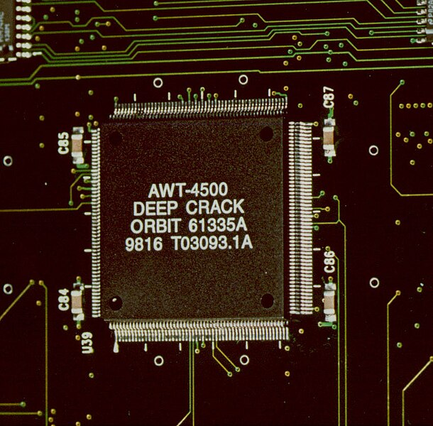

Welcome to Episode 4 of "Behind the Code", our enlightening series on the riveting History of Cryptography. 

Today, we'll be time-traveling from 1950 to 2000, diving deep into the intricate world of ciphers, groundbreaking algorithms, and the masterminds and institutions that crafted them... and broke them.

We start our journey on a chilly November 4, 1952. United States President [Harry S. Truman](https://www.whitehouse.gov/about-the-white-house/presidents/harry-s-truman/), has just unveiled the [NSA](https://www.nsa.gov/). This institution, which rose from the remnants of the Armed Forces Security Agency, was not just another government agency. It was destined to become the nucleus of America's nerve center for cryptographic innovation and decoding. But as the NSA's influence expanded, the rest of the world wasn't just sitting idly by. From Europe to Asia, nations were establishing their own cryptographic agencies, each contributing its own chapter to the grand story of cryptography.

As we delve into the 1970s, and the world was tapping their feet to Elvis's latest hits, the world of cryptography was abuzz with a groundbreaking cipher emerging from the labs of IBM. 

## The Data Encryption Standard (DES)

### It's emergence

The development of [Lucifer](https://en.wikipedia.org/wiki/Lucifer_(cipher)) paved the way for the establishment of the influential [Data Encryption Standard (DES)](https://en.wikipedia.org/wiki/Data_Encryption_Standard), which was officially accepted as a federal standard in the United States in 1977. Over the course of its development, the Data Encryption Standard (DES) emerged as a very prominent cryptographic algorithm, serving as a foundational framework for subsequent encryption methodologies. DES was hailed as a cryptographic marvel, setting the benchmark for encryption standards globally. However, Its 56-bit key size, while formidable at the time, was not without its vulnerabilities. 

### It's downfall

As technology advanced and computational power surged, DES began to show its cracks. By the late 1990s, the once-impervious DES faced its reckoning. Powerful computers and dedicated hardware, like the [Electronic Frontier Foundation's Deep Crack machine](https://en.wikipedia.org/wiki/EFF_DES_cracker), exposed the  the cipher's vulnerabilities.

In a startling demonstration, the Deep Crack managed to break a DES key in a mere 56 hours using a brute force attack, methodically trying all possible key combinations.

### Lesson's learned

This fallibility of DES served as a stark reminder in the cryptographic community: the relentless march of technology waits for no one and no cipher. As DES's vulnerabilities became evident, the quest for a more robust encryption standard was set in motion. 

Let's talk about some intriguing aspects of cryptography, specifically some identified weaknesses in the DES cipher key. First, it's crucial to understand that the primary criticism of DES lies in its 56-bit key size. This size means an adversary trying to do a brute-force attack would theoretically need to test 2^56 keys. With the tech available back then, it would take over 100 years to perform such an attack with a single-processor computer, testing a million keys every second. In 1998, the Data Encryption Standard (DES) was successfully cracked by a $250,000.00 machine named the EFF DES Cracker, or "Deep Crack." This machine was designed and built by the Electronic Frontier Foundation (EFF) specifically to demonstrate the vulnerabilities of DES by brute-forcing the encryption key. The EFF's "Deep Crack" decrypted a DES-encrypted message in less than three days, underscoring the need for more secure encryption standards. The achievement played a significant role in highlighting the limitations of DES and pushing the industry towards adopting stronger encryption methods.

As the digital era advanced, it became evident that mere encryption wasn't enough. The pioneering efforts of [Whitfield Diffie](https://twitter.com/WhitfieldDiffie) and [Martin Hellman](https://twitter.com/martinhellman2) in 1976 laid the groundwork for RSA, overshadowing DES. Developed by Ron Rivest, Adi Shamir, and Leonard Adleman at MIT, RSA was groundbreaking. Its uniqueness lay in its asymmetric nature. No longer did one need to share a secret key to communicate securely; a non-secret public key sufficed. However, its strength, based on the challenge of factorizing large numbers, turns out not to be as iron-clad as once thought. 

## The emergence of the Digital Signature Algorithm (DSA)

In the early 1990s, amidst the widespread adoption of AOL and the rise in popularity of grunge, cryptographers were actively engaged in the development of the [Digital Signature Algorithm (DSA)](https://en.wikipedia.org/wiki/Digital_Signature_Algorithm). Our journey through time, which began with an in-depth examination of cryptographic cyphers and progressed to the intricacies of asymmetric encryption, concludes here.

As we approach the conclusion of this era, we acknowledge the intricate interplay between the pursuit of novelty and the associated uncertainties. Advancements and risks are two key aspects that warrant examination and analysis. Cryptography, formidable as it is, has been and always will be challenged by those trying to keep secrets and those wishing to decipher its codes.

Stay tuned for our next episode, where we begin to explore the strengths and weaknesses of digital signature algorithms, and what the implications are for blockchain.