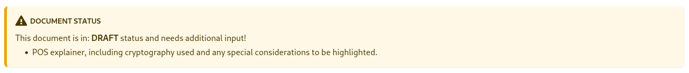

## Highlights

### Documentation revision for QRL + QRL Zond



Last month in the annals [QRL Weekly](/weekly/), we were happy to introduce everyone to the early stages of our revamped documentation for [QRL](https://docs-beta.theqrl.org) and [QRL Zond](https://zond-docs.theqrl.org) — redesigned, restructured, and renewed, aimed to elevate the user experience and facilitate more effective interactions with the QRL ecosystem.

**The Need for Revamping**

Proper documentation can make a significant impact on both users and businesses through enhanced usability, user onboarding, and reduced support loads. For newcomers, the initial impression can make or break their long-term relationship with a product. Revamped documentation aids in smooth user onboarding, acting as an efficient guide that helps users navigate through functionalities with ease.

Why fix something that isn't broken? This is a common argument against revamping existing documentation. However, it assumes that the current documentation is entirely effective, understandable, and in sync with the product. While the current documentation served us well, with evolving user needs, changes in features, and an upcoming major update (Zond!), documentation needed an overhaul to be effective.

**What's new**



The revamped documentation breaks things into a few sections that more easily guides people to do what they want to do.

1. **Use:** Any interaction with the QRL blockchain, including creating and working with Wallets, Nodes, other QRL tools, or mining.
2. **Build:** For developer related interactions with the QRL development ecosystem. From API calls to address schemes, CLI commands and Docker nodes. 
3. **API:** Covers the application programmer interface (API)
4. **Tutorials:** Guides to get started using the QRL. Walking through basic tasks like setting up a node, requesting blockchain data, or creating a simple application etc.

**What's left?**

While a significant portion of the revised documentation is complete, additional review and refinement are required before it can be completely replaced. You may observe, while perusing the documentation, that many of the sections have notices at the top signifying the page's status. As we work through those, we'll be closer to completely replacing the current documentation.

**How can I help?**

This is where you come in. By utilising the available documentation and offering constructive input, one may significantly contribute to refining the content and rectifying any imperfections or identifying mistakes. Although it may appear insignificant, maintaining the usability of our documentation may have a substantial influence on users and organisations seeking to incorporate and utilise the QRL in their products and systems.

**References**

- For QRL Zond
  - Website: https://zond-docs.theqrl.org 
  - Repository: https://github.com/theQRL/zond-documentation
- For QRL
  - Website: https://docs-beta.theqrl.org 
  - Repository: https://github.com/theQRL/documentation
- QRL old documentation
  - Website: https://docs.theqrl.org, 
  - Repository: https://github.com/theQRL/docs.theqrl.org

## QRL Zond Development

Implemented `go-zond-types`, `go-zond-wallet-types`, and `staking-deposit-cli` with `go-zond-wallet-encryptor-keystore` in progress. Staking the has been tested successfully to 3000+ blocks.

**Overview of components**

- `go-zond-types`, a library that has cryptography related data types supported by Zond.
- `go-zond-wallet-types`, a library that has datatypes related to Zond based wallet and uses `go-zond-types` for cryptography data types.
- `go-zond-wallet-encryptor-keystore` uses `go-zond-wallet-types` used to encrypt and decrypt the keystore files generated by `staking-deposit-cli`. This library will be used by the beacon node while importing validator wallet from the key store files for the purpose of staking.
- `staking-deposit-cli` generates multiple dilithium wallet for staking based on the parameters provided along with the keystore files with the dilithium seed encrypted with AES-128-CTR. It also generates files including details such as withdrawal credentials that would be used to create transaction that will be broadcasted further to start staking.

P2P synchronisation, a memory-related crash problem with the beacon chain, and state resumption were all fixed. Code to support account with smart contract code while generating genesis state from `genesis.json` was added as well, used to deploy deposit contract for staking in genesis block.

## Media

### History of Cryptography: Behind the Code (Ep #3)

We’re thrilled to release Episode #3 of our series, History of Cryptography: Behind The Code.

In our latest episode, we move from the end of WW1 through the 1940’s (WW2) covering everything from Enigma & codebreaking to Alan Turing & his teams work at Bletchley Park.

Check it out below or on the [associated blog](/blog/history-of-cryptography-behind-the-code-episode-3/) if you haven't already.



## Changelog

### theQRL/block-explorer

**[#346 Testnet<>Mainnet](https://github.com/theQRL/block-explorer/pull/432)**
			
- [[4eb1d](https://github.com/theQRL/block-explorer/commit/6d578c2afc18a56f1947072199d93daa0424eb1d)] Fix #346		
- [[531c7](https://github.com/theQRL/block-explorer/commit/2d4411f6383d8a04796e4a8cd2b43468863531c7)] Merge pull request #431 from jplomas/master

**[Fix #346](https://github.com/theQRL/block-explorer/pull/431)**
			
- [[4eb1d](https://github.com/theQRL/block-explorer/commit/6d578c2afc18a56f1947072199d93daa0424eb1d)] Fix #346		

**[Testnet <> Mainnet](https://github.com/theQRL/block-explorer/pull/430)**
			
- [[c756c](https://github.com/theQRL/block-explorer/commit/4de1d3fbc51973312f528e8fc49905dbe2ec756c)] Merge pull request #423 from theQRL/testnet
- [[a453c](https://github.com/theQRL/block-explorer/commit/9c42e298380f1123410a941e9c8187a6127a453c)] NFT hash display on mobile		
- [[41582](https://github.com/theQRL/block-explorer/commit/03e3d1929963d15cb2a52e86ac74352191441582)] Update NFT providers		
- [[2dcb1](https://github.com/theQRL/block-explorer/commit/27f11173ae9c80e7afcbf39d2151f60e29e2dcb1)] Merge pull request #424 from jplomas/master
- [[93c00](https://github.com/theQRL/block-explorer/commit/fcce837b88a98c2640b339e592a1e0bd02f93c00)] Bump nft-providers package version		
- [[94cd9](https://github.com/theQRL/block-explorer/commit/a3753b1efbefb3698dcee0e0d354a331a6b94cd9)] Merge pull request #425 from jplomas/master
- [[c60dc](https://github.com/theQRL/block-explorer/commit/f36c36d3e785125a39782a6b4677346d70bc60dc)] Fix NFT link on tx		
- [[888a3](https://github.com/theQRL/block-explorer/commit/fbd5f8c6267e4ebf540c85c6fac1f5c3bc6888a3)] Merge pull request #426 from jplomas/master
- [[0d15f](https://github.com/theQRL/block-explorer/commit/46ec0772d5e8beea4123249586ddbc140150d15f)] Re-do NFT tx link fix		
- [[e17f4](https://github.com/theQRL/block-explorer/commit/027286847304d7a432be28ab19697a22858e17f4)] Merge pull request #427 from jplomas/master
- [[cb174](https://github.com/theQRL/block-explorer/commit/78597650425c8668fb135346046d87ac120cb174)] Scaffolding for richlist from new API		
- [[618c1](https://github.com/theQRL/block-explorer/commit/20c692d0ef7b19342b5324d1b4876e3024b618c1)] Basic top 100 richlist for mainnet via richlist-api		
- [[32aba](https://github.com/theQRL/block-explorer/commit/9887aecd16de814278c1537e5fdd316bd5332aba)] Display balance in Quanta		
- [[bf623](https://github.com/theQRL/block-explorer/commit/f09dcd445c01cb7bfdb0960d4c9f9805054bf623)] Working load more & CSV export, version bump for deploy		
- [[8f4a1](https://github.com/theQRL/block-explorer/commit/d492d6f56957fddfb33522d37924b2301ae8f4a1)] Merge pull request #428 from jplomas/master
- [[36755](https://github.com/theQRL/block-explorer/commit/9e7ea858353000cba7c698c01289867913436755)] Fix rounding in address balance		
- [[b24b0](https://github.com/theQRL/block-explorer/commit/bcbbf84ddf9a5199de5c0a47ca358a40a1bb24b0)] Merge pull request #429 from jplomas/master

**[Fix rounding in address balance](https://github.com/theQRL/block-explorer/pull/429)**
			
- [[36755](https://github.com/theQRL/block-explorer/commit/9e7ea858353000cba7c698c01289867913436755)] Fix rounding in address balance		

### theQRL/QRL

**[Merged Dev branch](https://github.com/theQRL/QRL/pull/1778)**
			
- [[b5882](https://github.com/theQRL/QRL/commit/619631bd6cf6ea04959496d2d86eff2a425b5882)] Fix: walletd conversion of binary data in token name and symbol		
- [[44683](https://github.com/theQRL/QRL/commit/cd7e94d207e1205d5588d1ea4e82cc5682d44683)] Flake8 fix		
- [[13663](https://github.com/theQRL/QRL/commit/85f9631e902c491a79aeeb69747a6e84b6113663)] Merge pull request #1777 from cyyber/dev

**[Fix: walletd conversion of binary data in token name and symbol](https://github.com/theQRL/QRL/pull/1777)**
			
- [[2a868](https://github.com/theQRL/QRL/commit/7d1776eebe22021200586dc7824f8a5c8662a868)] Merge pull request #1776 from theQRL/dev

- [[b5882](https://github.com/theQRL/QRL/commit/619631bd6cf6ea04959496d2d86eff2a425b5882)] Fix: walletd conversion of binary data in token name and symbol		
- [[44683](https://github.com/theQRL/QRL/commit/cd7e94d207e1205d5588d1ea4e82cc5682d44683)] Flake8 fix		

### theQRL/theqrl.org

**[QRL Weekly, 2023-August-29](https://github.com/theQRL/theqrl.org/pull/367)**
			
- [[12066](https://github.com/theQRL/theqrl.org/commit/e9f193d4385b17941e8ddef8358f90c1ee412066)] QRL Weekly, 2023-August-29		

**[History of Cryptography ep 3](https://github.com/theQRL/theqrl.org/pull/366)**
			
- [[75d54](https://github.com/theQRL/theqrl.org/commit/116c0e4d7ed2ac3ac5d9e5f88c2302c8d2e75d54)] History of Cryptography ep 3		

**[QRL Weekly, 2023-August-22](https://github.com/theQRL/theqrl.org/pull/365)**
			
- [[23b50](https://github.com/theQRL/theqrl.org/commit/79db788da99cf33cc4b02b883fbafc3cb8b23b50)] Quantum news update		
- [[049d0](https://github.com/theQRL/theqrl.org/commit/cc5bad60ddfcc9d4611c227c104acc500c9049d0)] QRL Weekly, 2023-August-22		

**[QRL Weekly, 2023-August-15](https://github.com/theQRL/theqrl.org/pull/364)**
			
- [[7bee5](https://github.com/theQRL/theqrl.org/commit/681b934d193b4481e44f19546b236fb64017bee5)] Quantum news update		
- [[0bb0c](https://github.com/theQRL/theqrl.org/commit/029e0779e1b12d0b14391ede328c503fe7a0bb0c)] QRL Weekly, 2023-August-15		

**[QRL Weekly](https://github.com/theQRL/theqrl.org/pull/363)**
			
- [[43bfc](https://github.com/theQRL/theqrl.org/commit/ee591db2b0213f8af37dbc511712528f31943bfc)] QRL Weekly		

**[Add buildFuture to netlify config for future events](https://github.com/theQRL/theqrl.org/pull/362)**
			
- [[8fc69](https://github.com/theQRL/theqrl.org/commit/3afd84b3a814ef82ed53e4288c2cccfd5338fc69)] Add buildFuture to netlify config for future events		

**[Add Post-Quantum Cryptography Conference event ](https://github.com/theQRL/theqrl.org/pull/361)**
			
- [[65766](https://github.com/theQRL/theqrl.org/commit/326837b7793bcccb17edd8c3d4b7283eca765766)] Extend external_url to upcoming + adjust text/remove video		
- [[eafa9](https://github.com/theQRL/theqrl.org/commit/d1a35ce63b22f10fb80ac71b795e73ff4cfeafa9)] Add removed video to QRL Hackathon 2022 landing page		
- [[f1439](https://github.com/theQRL/theqrl.org/commit/b910bf15c98b13f23f2961f197ea0807a57f1439)] Event page style adjustments		
- [[3d745](https://github.com/theQRL/theqrl.org/commit/b884b76d0a6a59abefb57a0619bdc321ebf3d745)] Add Post-Quantum Cryptography Conference event
- [[f3ea2](https://github.com/theQRL/theqrl.org/commit/b7b43998ea926fcafbb73f352c0465a8667f3ea2)] Merge remote-tracking branch 'upstream/main'		

**[QRL blog adjustments](https://github.com/theQRL/theqrl.org/pull/360)**
			
- [[d201f](https://github.com/theQRL/theqrl.org/commit/44b590563fff41340eed6f2030a06cb389cd201f)] Title fix		
- [[da62c](https://github.com/theQRL/theqrl.org/commit/c415aa4c983cfc757aae3078fbd47ca9e54da62c)] Remove beta testnet estimated timeframe		

**[QRL Monthly - July 2023](https://github.com/theQRL/theqrl.org/pull/359)**
			
- [[2a7f1](https://github.com/theQRL/theqrl.org/commit/c4817aa51cda7a5463732d722d07100d4612a7f1)] QRL Monthly - July 2023		
- [[32995](https://github.com/theQRL/theqrl.org/commit/cdc79ae3ee5c699205fd6dc52950f55074432995)] Merge remote-tracking branch 'upstream/main'		
- [[8a0cc](https://github.com/theQRL/theqrl.org/commit/04365cc49364823efbec667a2835fa100f88a0cc)] BG Highlight Fixes		

**[QRL Weekly Update - W30](https://github.com/theQRL/theqrl.org/pull/358)**
			
- [[ae553](https://github.com/theQRL/theqrl.org/commit/9c0fbb9e25bc6f47a0a298388776f3e000aae553)] QRL Weekly Update - W30		

## Quantum News

{}