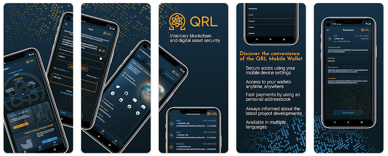

## Highlights

### QRL Mobile Wallet from Volt Development officially available



The QRL Mobile Wallet, developed by [Volt Development](https://volt-development.com/), has been officially released to [Google Play](https://play.google.com/store/apps/details?id=com.volt.qrlmobile&pcampaignid=web_share) and the [Apple App Store](https://apps.apple.com/us/app/qrl-mobile/id6448219494).

Current functionality: 

- Create and manage multiple wallets including importing and exporting
- Create QRL Tokens
- Send/receive QRL
- Receiving transactions and sending transactions to one or multiple recipients simultaneously
- Add a message to your transaction
- Send/receive QRL Tokens
- Notarize documents
- Verify notarized documents
- Send on-chain messages
- Viewing your transaction history
- Multiple Language support including English, Japanese, Chinese, German, Korean, Dutch, Italian, Spanish, Russian
- Receiving notifications for QRL price changes and/or received transactions

[Volt Development](https://volt-development.com/) would like to extend its gratitude to everyone who has helped with testing, translating, and providing comments! 

Of course, the QRL mobile wallet is [open source](https://gitlab.com/Volt-Development/qrl-mobile-wallet) under the [MIT License](https://gitlab.com/Volt-Development/qrl-mobile-wallet/-/blob/main/LICENSE?ref_type=heads).

> *This wallet comes from the **QRL Grants Programme**. Have an idea to support to the QRL ecosystem? See more information on the [QRL Foundation grants programme page](https://qrl.foundation/grants.html).*

## Development

### QRL Zond Development

Several changes and improvements have been made to the execution node and related packages. One notable change is the unification of the `pqaccounts` and account packages into a single account package. Additionally, the `pqcrypto` package has undergone fixes and updates, including changes to the sign function.

The update also introduces a constant named `DilithiumSignatureLength` and makes various changes to transaction data and API to support Dilithium-based wallets. This includes added and initializing `DilithiumWithdrawalPrefixByte`, `ZondAddressWithdrawalPrefixByte` & `DomainDilithiumToExecutionChange` in config, fields which are used in the `staking-deposit-cli` for staking deposits and withdrawal.

This includes updates to the `RPCTransaction API` with new fields for PublicKey and Signature. Transaction marshalling has been updated to accommodate these new fields for `Dilithium` compatibility.

Several bug fixes and unit test updates have been implemented, and successful testing has been conducted for making and signing transactions from the CLI. Transaction Pool in the `Execution Node` has also been tested successfully, including fund transfers between `Dilithium` wallets.

The update covers progress in validator staking, including the exit of validators and withdrawal of balances. Non-required flags have been removed from the staking-deposit-cli, and various bug fixes and improvements have been made.

Want to stay up to date week-to-week? Be sure to check out [QRL Weekly](/weekly) put out on Tuesdays.

#### When QRL Zond Beta-Testnet?

It won't be too much longer before everybody gets to try out the beta version of the QRL Zond beta-testnet network! The majority of the time is spent testing newly added functionality before it is made available to the team in order to ensure that appropriate documentation is created.

Generally:

- Node stability test ✅
- Testing of validator staking deposit and withdrawal ✅
- Testing of transfer of funds using dilithium wallet 🔎 <-- in Progress
- Testing of contract deployment using dilithium wallet
- Testing of contract interaction using dilithium wallet
- Final cosmetic changes and basic documentation to install, run, stake and de-stake

### New Developer: Ricardo Geraldes

We'd like to extend a warm welcome to **Ricardo Geraldes**, who has recently joined us as a Senior Software Engineer based in Dubai, United Arab Emirates (UAE).

*Ricardo Geraldes* has held prominent positions in several esteemed organisations. He has served as a lead engineer at [ngram](https://www.ngram.com/), a reputable LLM analytics firm, as well as a principal software engineer at Live Planet and Kowala. Additionally, he has worked as a software engineer at [status.im](https://status.im/), contributing to the development of a secure messaging application, a cryptocurrency wallet, and a Web3 browser.

### Developer: Abhijeet Sarkar

Though they've been with us for a year, we'd be remiss if we didn't introduce everyone to **Abhijeet Sarkar**, who has joined us as a Software Development Engineer developing the next-generation post-quantum resistant blockchain, QRL.

*Abhijeet Sarkar* is an experienced software engineer with expertise in Go (Golang) development, Redis, PostgreSQL, Docker, Kubernetes, and Jenkins. They are proficient in version control systems like Git, GitHub, and Bitbucket, and have experience in automation testing and data scraping with Selenium WebDriver. They are familiar with project management tools such as Atlassian JIRA and communication platforms like Slack. Additionally, they have strong knowledge of AWS, including AWS Lambda and EC2, and are familiar with stream processing using Confluent Kafka. They are committed to delivering robust and scalable solutions while emphasizing best practices, quality, and performance.

## Changelog

### theQRL/go-zond-wallet-encryptor-keystore

**[Updated dependencies](https://github.com/theQRL/go-zond-wallet-encryptor-keystore/pull/5)**
			
- [[f3325](https://github.com/theQRL/go-zond-wallet-encryptor-keystore/commit/c3d752537238da5b3bcedc1a5ea91f7d055f3325)] Updated dependencies		

**[Encryption and decryption is generalized for any message](https://github.com/theQRL/go-zond-wallet-encryptor-keystore/pull/4)**
			
- [[76639](https://github.com/theQRL/go-zond-wallet-encryptor-keystore/commit/ba59a24da7296de2441e2d164f7b3e4d4d576639)] Encryption and decryption is generalized for any message		

**[Implemented zond wallet encryptor keystore](https://github.com/theQRL/go-zond-wallet-encryptor-keystore/pull/3)**
			
- [[63cf6](https://github.com/theQRL/go-zond-wallet-encryptor-keystore/commit/17d096c59bcd0fecba8aedd7acb30e9ca5363cf6)] Added .gitignore		
- [[52b92](https://github.com/theQRL/go-zond-wallet-encryptor-keystore/commit/a3587b0d7d6eeaa893a30922673abdef7dd52b92)] Implemented zond wallet encryptor keystore		

### theQRL/qrl-rich-list-indexer

**[Fix: Added code to update the accounts collection](https://github.com/theQRL/qrl-rich-list-indexer/pull/9)**
			
- [[5570a](https://github.com/theQRL/qrl-rich-list-indexer/commit/3e6d83335b37848a81c0f5f10233154daeb5570a)] Fix: Added code to update the accounts collection		

### theQRL/theqrl.org

**[QRL Weekly, 2023-September-26](https://github.com/theQRL/theqrl.org/pull/372)**
			
- [[2fa0c](https://github.com/theQRL/theqrl.org/commit/14589fbb9d36ce38f12bb8d03da98815c2a2fa0c)] QRL Weekly, 2023-September-26		
- [[551a2](https://github.com/theQRL/theqrl.org/commit/71af824962ed6df5508c6a117cb76fc7fc6551a2)] Image processing script modification		

**[QRL Weekly, 2023-September-19](https://github.com/theQRL/theqrl.org/pull/371)**
			
- [[ff033](https://github.com/theQRL/theqrl.org/commit/4911e9e32179e9196d48ddedd44ad9b5ab9ff033)] Quantum News Update		
- [[220fd](https://github.com/theQRL/theqrl.org/commit/6ab9dff4227128cf60b11769e0d182f99b8220fd)] QRL Weekly, 2023-September-19		
- [[bc84b](https://github.com/theQRL/theqrl.org/commit/6e52e59b23591892fb527fd63931e3f757cbc84b)] Merge remote-tracking branch 'upstream/main'		

**[QRL Weekly, 2023-September-12](https://github.com/theQRL/theqrl.org/pull/370)**
			
- [[42c77](https://github.com/theQRL/theqrl.org/commit/e21e5d878059614a70d8036b80d1d65420842c77)] Quantum news updates		
- [[6fc5a](https://github.com/theQRL/theqrl.org/commit/92f3926a8e4f5c768f9b51fd46c8b02f5ea6fc5a)] QRL Weekly, 2023-September-12		
- [[d27c3](https://github.com/theQRL/theqrl.org/commit/25d261a0a86c029d8bf4e8d5e2351826b17d27c3)] Merge remote-tracking branch 'upstream/main'		

**[QRL Weekly, 2023-September-05](https://github.com/theQRL/theqrl.org/pull/369)**
			
- [[7c8fc](https://github.com/theQRL/theqrl.org/commit/6dfddab00a3e58b4799ec57e0bca99c63427c8fc)] QRL Weekly, 2023-September-05		
- [[4e689](https://github.com/theQRL/theqrl.org/commit/acaf715a6038fff3aefd467c0f51e2917004e689)] quantum news		

**[QRL Monthly: feat QRL Documentation Revision - August 2023](https://github.com/theQRL/theqrl.org/pull/368)**
			
- [[f34d6](https://github.com/theQRL/theqrl.org/commit/66357793c36b36c4b7e0c314d70b7f9bc6af34d6)] QRL Monthly: feat QRL Documentation Revision - August 2023		
- [[7e13d](https://github.com/theQRL/theqrl.org/commit/e6cbbc8e413f2af784a65c018cccf52419a7e13d)] Slight bg modification

## Quantum News

{}