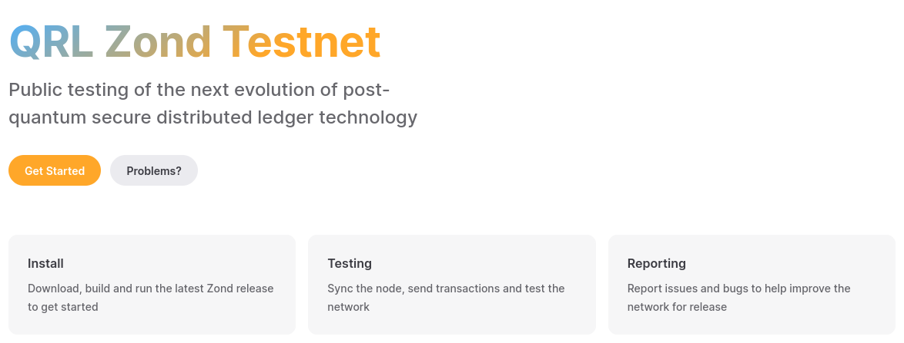

We're very happy to announce QRL Zond beta-testnet, the second milestone in the revival of our proof-of-stake protocol with EVM (Ethereum Virtual Machine) smart contract compatibility. 

For blockchain developers, this current release represents an excellent opportunity to begin experimenting with the network and developing dApps, using the included EVM (Ethereum Virtual Machine) smart contracts compatibility and the availability of a comprehensive web3 API.

**Those wanting to jump directly into it will want to head over to [Test Zond](http://test-zond.theqrl.org) to get started.** There, you'll find information on getting started with QRL Zond with more tutorials and guides in the pipeline. This blog is here as an overview of where we are with QRL zond, the next generation in secure digital assets.

## QRL Zond beta-testnet v1

QRL Zond is a quantum safe network to build next generation applications using a combination of post-quantum secure methods along with architecture with those that should be familiar with the worlds largest blockchain ecosystem - Ethereum.

The combination of these factors creates a unique environment where developers and institutions can confidently pave the way to a quantum-safe future without the need for additional technical or financial resources in the decentralized finance (DeFi) space.

In essence, QRL Zond serves as a bridge to the future, addressing the impending challenges posed by quantum computing to traditional cryptographic systems. As [quantum computers continue to advance](/why), the risk of compromising the security of existing blockchain networks becomes a growing concern. QRL Zond proactively tackles this issue by providing a secure and adaptable platform that leverages post-quantum secure methods.

### High level network overview

The network is broken into a consensus client and a execution client which work in tandem to create a peer-to-peer network capable of running proof-of-stake, executing smart contracts, and maintaining the distributed ledger state locally.

[Go-zond](https://github.com/theQRL/go-zond/), the *execution client*, actively monitors newly broadcasted transactions within the network, processes them through the QRL Virtual Machine (QVM), and maintains an up-to-date record of the latest state and database, encompassing all existing QRL data.

The *consensus client*, commonly known as the beacon node and identified as [qrysm](https://github.com/theQRL/qrysm), plays a crucial role in executing the proof-of-stake consensus algorithm. This algorithm holds significance as it enables the network to achieve consensus by depending on validated data sourced from the execution client, ensuring the reliability and integrity of the overall network operations.

Setup of both clients are simple with binaries for Windows, Linux, and MacOS (instructions can be found over at [test-zond](https://test-zond.theqrl.org))

### Developing on Zond: Smart Contracts & Web3 

A noteworthy improvement in the QRL Zond beta-testnet from QRL is the inclusion of Web3 compatibility, which comes pre-configured for developers. This ensures that the Web3 environment is seamlessly integrated and interacted with, avoiding the need for additional preparations or configurations. 

As people set up their nodes and receive distributed QRL on the beta-testnet, further documentation and guides will be provided.

### After QRL Zond beta-testnet V1 (When mainnet?)

Following the release of QRL Zond beta-testnet v1, there will be several notable changes and improvements. Several Zond testnet releases are expected, each focusing on correcting any recognised flaws uncovered during the initial testing phase. This will increase network functionality and reliability.

This includes such things as:

1. The support for the new address format, as outlined in the latest [QIP-018](/qips/qip018/) by Robyer, will be integrated.
2. XMSS Support, to be implemented after the first testnet release, along with the introduction of a Slave feature for XMSS-based wallets. 
3. Configuration parameters such as staking reward, penalty amount, and minimum staking requirements will be established. 
4. More unit tests, integration tests along with other tests as required. 
5. Changes based on components such as CLI, wallet, explorer (not limited to) based on user/community/team feedback.

The beta classification will be withdrawn as the dependability and feature set improve, and we'll be in the home stretch (see: Network Timeline below) towards mainnet.

Developers can now pave their way into the future, and can expect increased reliability and features as time progresses.

#### The Network Timeline

The QRL Zond ecosystem will eventually run with 3 networks in parallel. 

*First* is **Devnet**, which is a hot-off-the-repo network with frequent updates and breakages. Our public devnet milestone was realized late 2022 and meant that the QRL Core Contributors had a chance to begin testing the network ensuring for a smoother operation for the the beta-testnet, which we're happy to have released today as version 1 (`QRL Zond beta-testnet v1`) !

**Testnet** is more intended for public consumption and is where the codebase starts showing its true and final form. **For those wanting to write software,** this is where to do it, though some might want to wait until the *beta* label is removed and more tooling is built around it. Right now we'd consider the network and code stable enough to be predictable and built upon, but flexible enough to accept many proposed changes to make that third-party development easier.

The final form before release is a full testnet/release candidate. Code is frozen with the exception of bug fixes. An audit is begun at this time, and a continuous cycle of trying to stress the system to iron out any last pain points is performed. 

## Concluding

QRL Zond beta-testnet is something that’s been in the works for years and is finally taking shape with more updates to come. You can follow all QRL Zond updates by visiting our [proof-of-stake](https://www.theqrl.org/features/proof-of-stake/) features page.

*What do you think?* Join us in one of our many forums on [Telegram](https://t.me/QRLedgerOfficial), [Discord](/discord), or [Reddit](https://www.reddit.com/r/qrl). Or talk about everything else QRL to quantum computers and everything in-between.

Want to stay up to date? Follow us on [Youtube](https://www.youtube.com/c/QRLedger), [Twitter](https://twitter.com/qrledger) or our [Telegram](https://t.me/TheQRLedger) news channel.

Want to dig into our audited, MIT open-source, enterprise-grade codebase? Check out our github at: [https://github.com/theQRL/zond/](https://github.com/theQRL/QRL/)

