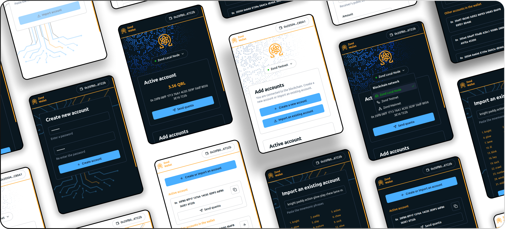

## QRL Highlights, the Zond Wallet Extension

If you're already familiar at navigating the decentralized web with the [MetaMask](https://metamask.io/) browser extension, which seamlessly bridges your digital identity and assets to a multitude of Web3 applications, you'll be right at home by our latest, the [Zond Wallet Extension](https://github.com/theQRL/zond-wallet). 

The [Zond Wallet Extension](https://github.com/theQRL/zond-wallet) will support a diverse range of applications, from peer-to-peer payment systems and decentralized storage solutions to document signing. It is also essential for functioning within metaverse platforms, decentralized autonomous organizations (DAOs), and decentralized exchanges. These use cases are particularly sensitive as they often involve substantial transactions and sensitive personal information. Here, the post-quantum resistance of the Zond Wallet ensures that users' identities and assets remain secure even as quantum technology evolves. 

This makes the Zond Wallet a forward-thinking choice in an era where digital security is paramount, and is the first thing that distinguishes it from the MetaMask browser extension, which carries assets which are vulnerable to a sufficiently powerful enough quantum computer. Of course, this is all MIT open source, further driving home our continued vision of ensuring not just assets, but whole ecosystems are developed with longevity in mind.

Right now, the initial version of the Zond Chrome extension wallet is complete, with further enhancements for token support and decentralized applications (dApps) underway. The user interface is also being polished for a better user experience. 

**Other Zond Developments**

Recent efforts in QRL Zond have included comprehensive code reviews and enhanced testing to bolster system integrity and performance. 

Key components such as  `applyTransaction`, `ApplyMessage`, `TransitionDB`, `preCheck`, `IntrinsicGas`, `stateDB.Prepare`, `setNonce`, `refundGas`, `types`.`Receipt`, and `StateDB.Finalise` have been meticulously scrutinized, while functionalities like Prefetch mechanisms in TrieDB, RawDB, and associated systems have also been evaluated. 

Ongoing reviews target Processor functions to optimize block management and state handling. 50 tracing tests have been implemented to ensure robustness and address potential issues early. 

Want to roll your own zond node? Be sure to visit [Test Zond](https://test-zond.theqrl.org) to learn more.



## In case you missed it

### SwapSpace Huddle feat. Michael Strike: The Good, the Bad, and the Ugly of Quantum Computing

We're happy to have joined SwapSpace over the last month for the launch of their new podcast series, SwapSpace Huddle, which launched on September 3rd. If you missed it, give it a listen below



### Blockchain  Dialogues, ep 69: Interview with Quantum Resistant Ledger (QRL)

Michael Strike (Director of Outreach) and Ryan Malinowski (Director of Advocacy) at QRL sat down with Blockchain Dialogues and discussed what quantum computing is, the challenges it poses to crypto and blockchains and how QRL looks to tackle them.

You can find the official [blog post](https://bcdialogues.com/2024/09/01/ep-69-interview-quantum-resistant-ledger-qrl/) or find the episode in your favourite podcast app.

## Development changelog

### theQRL/go-qrllib

**[Updated XMSS MaxHeight limit panic message](https://github.com/theQRL/go-qrllib/pull/40)**
			
- [[b2210](https://github.com/theQRL/go-qrllib/commit/aee32c730090fe020990100a38bfe183a81b2210)] Updated XMSS MaxHeight limit panic message		

**[Limit XMSS MaxHeight to 30](https://github.com/theQRL/go-qrllib/pull/39)**
			
- [[2632d](https://github.com/theQRL/go-qrllib/commit/96d74a483546b78d147a3a3b7eee211c6032632d)] Limit XMSS MaxHeight to 30		

### theQRL/theqrl.org

**[QRL Weekly, 2024-August-27](https://github.com/theQRL/theqrl.org/pull/440)**
			
- [[5a628](https://github.com/theQRL/theqrl.org/commit/b1f4726a4c437752e05a14b42139a14512c5a628)] QRL Weekly, 2024-August-27		

**[Add Tapbit Exchange](https://github.com/theQRL/theqrl.org/pull/439)**
			
- [[2f986](https://github.com/theQRL/theqrl.org/commit/ddd120ef3562f568bb5bf8b51371c65a0ab2f986)] Add tapbit exchange		

**[QRL Weekly, 2024-August-20](https://github.com/theQRL/theqrl.org/pull/438)**
			
- [[adba2](https://github.com/theQRL/theqrl.org/commit/1fb609bf415cd028043670dd993e049614fadba2)] Quantum News Updates + Threshold		
- [[4da68](https://github.com/theQRL/theqrl.org/commit/7952b226d12cc042da94372975f742945534da68)] Add QRL Weekly		
- [[5e8ab](https://github.com/theQRL/theqrl.org/commit/4c22ede89193321c378540b49ff5d2c72f65e8ab)] Add thresholds to quantum news		
- [[e3ed7](https://github.com/theQRL/theqrl.org/commit/11812474acb3b13e81ca5e48075d072e7b2e3ed7)] Add quantum news orgs		

**[QRL Monthly, July 2024](https://github.com/theQRL/theqrl.org/pull/437)**
			
- [[fe6b5](https://github.com/theQRL/theqrl.org/commit/a1ba0ee5a6baec65cbea3e50dff12f85ea0fe6b5)] QRL Monthly, July 2024		
- [[9b892](https://github.com/theQRL/theqrl.org/commit/72ef764b57fa97a13b5ee329fd80b04bbfd9b892)] Merge remote-tracking branch 'upstream/main'		

**[New QRL Weekly, 2024-July-30](https://github.com/theQRL/theqrl.org/pull/436)**
			
- [[0f979](https://github.com/theQRL/theqrl.org/commit/b65a573f2d2c4a8d770043c71fb55128c310f979)] AMA Blog Revisions		
- [[5129b](https://github.com/theQRL/theqrl.org/commit/083c9a225273a8b95b660da6566b04a20805129b)] New QRL Weekly, 2024-July-30		
- [[31fc0](https://github.com/theQRL/theqrl.org/commit/ea5aff1ac51ed9820815d75b718685ccce231fc0)] QRL Weekly adjustments		

## Quantum Computing Developments

{}
