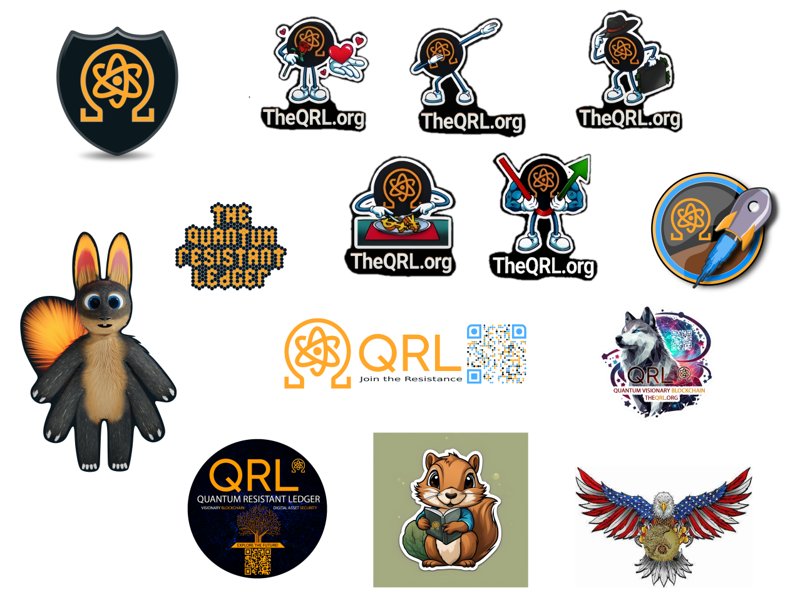

## Featuring

### Updates and Insights: The Future of QRL AMA with lead developer Kaushal Kumar Singh

In our latest AMA session, we had the pleasure of sitting down with Kaushal Kumar Singh, the lead developer of the QRL project, to discuss the exciting advancements and future direction of Zond.

If you missed it, you'll want to check out the video below or the [associated blog](/blog/updates-and-insights-the-future-of-qrl-ama-with-kaushal-kumar-singh/) that gives some key highlights of what's covered.



### QRL Post-Quantum Panel w/ Anastasia Marchenkova & Konstantinos Karagiannis | Episode #1

Our intention for this new segment is for us to dive into the latest advancements, hurdles, and implications of post-quantum technologies… while importantly keeping it all in a conversational feel (that’s still approachable).

In this episode, QRL Show co-hosts Ryan and Michael from the $QRL core team are joined by two great guests in Anastasia Marchenkova & Konstantinos Karagiannis for an exciting hour long panel discussion.

We cover:

- How each of our guests got involved in quantum technology
- How do you explain quantum computers?
- Hashing
- Bringing quantum computers to scale
- Superposition
- How close (or far away) are we to quantum supremacy?
- NIST Standards, Bitcoin Taproot upgrade
- and much more

You definitely don’t want to miss this episode...you can check it out in full below

 

## Zond Development

The Development team behind has been hard at work reviewing and refining code, adding tests, and releasing new tools to make the Zond more stable, user-friendly, all the while being secure against future threats like quantum computing. 

- Multiple rounds of code reviews have been conducted focusing on various functions including reorganization (`ReorgNeeded`), prefetching (`StartPrefetcher`, `Prefetch`), transaction management (`writeKnownBlock`, `writeHeadBlock`), block handling (`RecoverFromBlocks`, `WriteHeadBlock`, `WriteCanonicalHash`), signature verification (`BlockSignatureBatch`, `VerifyHeaders`), and [more](/weekly/).
- Ongoing code reviews for insertChain and chain reorganization (reorg).
- More unit tests to improve test coverage.
- Version 0.1.2 of `wallet.js` has been released on GitHub
- New type description for the Dilithium wallet.

## The QRL Community

### Sticker Contest

For the month of July, The QRL Team hosted a design contest for our new sticker packs! These packs will be utilized with our education/university outreach program that will focus on establishing relationships with students/universities with programs centered around cryptography and will seek to promote awareness and collaboration with the QRL at a higher education level. 

Below are some of the entries from the QRL Community. Feel like you missed out? Be sure to join our community over on [Discord](/discord) to get notifications on community events like this.

Winners for this contest were

- 🥇 1st Place - qrlcoin with his QRL Stick Man Figurines  
- 🥈 2nd place - dralinho with the Squirrel/QRL book design  
- 🥉 3rd place - otdto with the QRL Rocket Coin Design  

## Development changelog

### theQRL/block-explorer

**[fix: KnownProvider bug in tx and NFT responsive](https://github.com/theQRL/block-explorer/pull/436)**
			
- [[95e4d](https://github.com/theQRL/block-explorer/commit/c30b8d013b872cd7ba1ee88c38834c5d63995e4d)] fix: KnownProvider bug in tx and NFT responsive		

### theQRL/go-qrllib

**[Add warning to README](https://github.com/theQRL/go-qrllib/pull/36)**
			
- [[68254](https://github.com/theQRL/go-qrllib/commit/88d1fd4d182b7467eb5dad664bee1eea34068254)] Add warning to README		

**[Fix dilithium tests and qrllib-js build errors & add CI](https://github.com/theQRL/go-qrllib/pull/35)**
			
- [[cd88f](https://github.com/theQRL/go-qrllib/commit/0ea053c012726e7d935509e2fae4484b07bcd88f)] Fix dilithium tests and qrllib-js build errors		
- [[3d503](https://github.com/theQRL/go-qrllib/commit/7131bab67c6fde4ef970b52569c14b081fe3d503)] Add CI tests		
- [[ddb91](https://github.com/theQRL/go-qrllib/commit/07f4811a1afe9ee6b29435a4696ac5f8eefddb91)] CI fix		
- [[0d0aa](https://github.com/theQRL/go-qrllib/commit/1370529c9c8331523ec78b68fec256d1be40d0aa)] Add latest go version to CI tests		
- [[b6642](https://github.com/theQRL/go-qrllib/commit/9908d2e08cee571439f6c3c397fe3a9f3e9b6642)] Run CI tests on PR as well as push		

**[Bump golang.org/x/crypto from 0.0.0-20220622213112-05595931fe9d to 0.17.0](https://github.com/theQRL/go-qrllib/pull/34)**
			
- [[5cfc4](https://github.com/theQRL/go-qrllib/commit/473b3dc9e83414779d7658c931ee50b62cb5cfc4)] Bump golang.org/x/crypto

**[Revert to fix very old QRLLIB bug (of zero impact)](https://github.com/theQRL/go-qrllib/pull/33)**
			
- [[02c6e](https://github.com/theQRL/go-qrllib/commit/b66ad15c0252842b88bd864865c75feb99b02c6e)] Revert to fix very old QRLLIB bug (of zero impact)		

**[Use old address descriptor when constructing legacy addresses](https://github.com/theQRL/go-qrllib/pull/32)**
			
- [[1b5b1](https://github.com/theQRL/go-qrllib/commit/9e0286111989a6acb9a7a8bef92f55062061b5b1)] Use old address descriptor when constructing legacy addresses		
- [[87f5c](https://github.com/theQRL/go-qrllib/commit/390a9c3a66e101f3081e979200e65d2b97d87f5c)] Revert to Mainnet xmss descriptor		
- [[20a4d](https://github.com/theQRL/go-qrllib/commit/763851d2a967f680596bd5fdb4ee66a9bbc20a4d)] Merge remote-tracking branch 'origin/main'		

### theQRL/theqrl.org

**[QRL Weekly, 2024-July-23](https://github.com/theQRL/theqrl.org/pull/434)**
			
- [[0c066](https://github.com/theQRL/theqrl.org/commit/50269657d5ccddfec63c77312f5cba9bbda0c066)] QRL Weekly, 2024-July-23		

**[QRL Weekly, 2024-July-16](https://github.com/theQRL/theqrl.org/pull/433)**
			
- [[82772](https://github.com/theQRL/theqrl.org/commit/cd7e196d96b00262cd3ffc8126f3afba20f82772)] QRL Weekly, 2024-July-16		
- [[032e2](https://github.com/theQRL/theqrl.org/commit/a541ae185400d594c6cadba511a1459ea46032e2)] QRL Explainer Header Update		
- [[6496e](https://github.com/theQRL/theqrl.org/commit/78d98e4910f0021ffcba2df8865a89c42566496e)] Header size update		
- [[1aaa5](https://github.com/theQRL/theqrl.org/commit/ec06456f8869b4be276c70065ae5703bcad1aaa5)] Header adjustments		

**[New page: A visionary, future-proof blockchain with unparalleled security](https://github.com/theQRL/theqrl.org/pull/432)**
			
- [[5dab9](https://github.com/theQRL/theqrl.org/commit/be648e292e98286b48f09d41d9fb8a989dd5dab9)] New page: A visionary, future-proof blockchain with unparalleled security		
- [[6c602](https://github.com/theQRL/theqrl.org/commit/a99a976918b6648c60dec9008c6014ee6706c602)] New quantum news update		

**[QRL Weekly, 2024-July-09](https://github.com/theQRL/theqrl.org/pull/431)**
			
- [[f0e75](https://github.com/theQRL/theqrl.org/commit/74702058b19cae9cbafb2c404c005839a5cf0e75)] Quantum news update		
- [[3b319](https://github.com/theQRL/theqrl.org/commit/04ccbb3074fdbb68e0ab7b43b80f8ab7a363b319)] QRL Weekly, 2024-July-09		

**[Fix _headers](https://github.com/theQRL/theqrl.org/pull/430)**
			
- [[09006](https://github.com/theQRL/theqrl.org/commit/c07664e1c7d1229c00b6ef3b523ed65d24709006)] headers change		
- [[cd293](https://github.com/theQRL/theqrl.org/commit/3fc95dc1c9e1c679d228dc9502da2b29436cd293)] More headers tinkering		
- [[f455e](https://github.com/theQRL/theqrl.org/commit/16965e7a0ee98095468edc81adf7b27576df455e)] More headers		
- [[47443](https://github.com/theQRL/theqrl.org/commit/175c107508864248f876994bc2f25f641de47443)] executionContexts		
- [[3ae6b](https://github.com/theQRL/theqrl.org/commit/2e55105eadaeaad1f2ed30f0e243f6479cf3ae6b)] CSP		
- [[d4dbd](https://github.com/theQRL/theqrl.org/commit/cfa6784560d9431f01669282b37710c2c39d4dbd)] revert clear		
- [[89d47](https://github.com/theQRL/theqrl.org/commit/c01eb3a2a586ca56768d22003db3e43fa7a89d47)] remove clear site header		
- [[ff4da](https://github.com/theQRL/theqrl.org/commit/b33d72bec25af3bba92fc64346833f30759ff4da)] more headers		
- [[dbd7d](https://github.com/theQRL/theqrl.org/commit/a92cdb48f8b7bf519fe9d9d1cb3bf6f1545dbd7d)] more headers		
- [[b0476](https://github.com/theQRL/theqrl.org/commit/c3a064738873b4ad3ffb8ee867cc41c9786b0476)] headers		
- [[af9be](https://github.com/theQRL/theqrl.org/commit/dddc08f9fdb561cb12ae01ee7397db42a98af9be)] headers		
- [[a4a20](https://github.com/theQRL/theqrl.org/commit/dbd20cb54f71cedb138f879c9fdd1ec753aa4a20)] headers...		
- [[21ff1](https://github.com/theQRL/theqrl.org/commit/6a5dce1c2ca74926ead6047cb795ce735d821ff1)] headers		
- [[1d756](https://github.com/theQRL/theqrl.org/commit/75f0827aca6e2f35f67cd2e631383274cff1d756)] embeds		

**[New Blog: QRL Monthly, June 2024](https://github.com/theQRL/theqrl.org/pull/429)**
			
- [[5d2dd](https://github.com/theQRL/theqrl.org/commit/f60eb6baec3d405e7efb30c6305f013f9705d2dd)] New Blog: QRL Monthly, June 2024		

**[QRL Weekly, 2024-July-02](https://github.com/theQRL/theqrl.org/pull/428)**
			
- [[6758b](https://github.com/theQRL/theqrl.org/commit/b271d458aca63e776b701b15b3d4e20015b6758b)] QRL Weekly, 2024-July-02		
- [[2c1dc](https://github.com/theQRL/theqrl.org/commit/e6bc5646043fc0ec3056d98668fe93438772c1dc)] Adjust QRL Weekly script to have last 3 weeks of quantum news items		

### theQRL/wallet.js

**[Bump version in package.json](https://github.com/theQRL/wallet.js/pull/17)**
			
- [[b4ce3](https://github.com/theQRL/wallet.js/commit/83d5a37d7b26a4eaa606ab658c5f41e4a04b4ce3)] Bump version in package.json		

**[:test_tube: Adds type declarations to build files](https://github.com/theQRL/wallet.js/pull/16)**
			
- [[13b09](https://github.com/theQRL/wallet.js/commit/d384bd00cfb772dd05d80a828ce3287174a13b09)] fix: adds type declarations to build files		

**[Bump version in package.json](https://github.com/theQRL/wallet.js/pull/15)**
			
- [[ee76e](https://github.com/theQRL/wallet.js/commit/7fa0cacbc5a451451a8976ba8c60345853fee76e)] Bump version in package.json		

**[:white_check_mark: Added type declarations for the JS library exports](https://github.com/theQRL/wallet.js/pull/14)**
			
- [[56943](https://github.com/theQRL/wallet.js/commit/2456420bca73c38ee6b0ee90e271ae5e34256943)] fix: exports library via index js		

**[:heavy_check_mark: Added type declarations for the JS library exports](https://github.com/theQRL/wallet.js/pull/13)**
			
- [[4cb92](https://github.com/theQRL/wallet.js/commit/738a4ad1a271db708022c8ae7116524fa344cb92)] feat: adds type declarations for the library		
- [[20dbb](https://github.com/theQRL/wallet.js/commit/296fd76e0832b3b5e397737edc509f2de9320dbb)] feat: exports all exported items via index		
- [[7544d](https://github.com/theQRL/wallet.js/commit/1ddc7395d6ad6290dcc6ed12ed880a4cadf7544d)] build: generates type declarations		

## Quantum Computing Developments

{}
