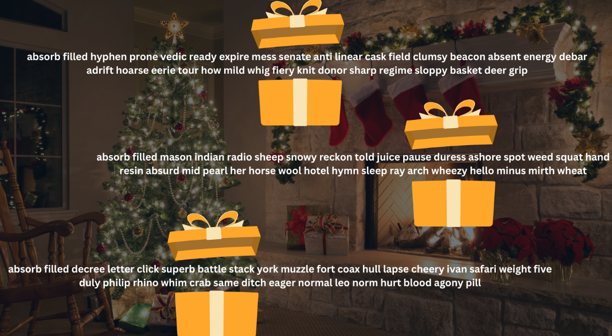

## Day 8: Bring a Brain to the Chain



Welcome to Day 8 of the 12 Days of Zond! Today’s festive theme is a call to action for the community to invite your smartest dev friends to join our post-quantum party: Bring a Brain to the Chain! 🧠 ⛏

### What Is It?

Who is one (or a few) of the smartest developers, coders, or tech-savvy friends you know that love to build, explore, and innovate? But they haven’t yet been introduced to the project 🤯

Today’s event is all about inviting them into Zond early as we shape the future of quantum-resistant blockchain technology…

This is your chance to share Zond’s vision with talented developers (you know) who you believe can contribute, learn, and grow with the project. They’re joining a community that’s leading the charge into the post-quantum era.

### How to Participate

1. Think of Your Smartest Developer Friend(s)
   - It could be a current or past colleague, a friend, or someone else you know and admire online for their coding skills, problem-solving, or curiosity about blockchain and cryptography.
2. Send Them an Invitation
   - Invite them to join Zond and our [QRL Discord](/discord) community. Can be a quick message like the one below or write whatever you want based on how well you know them.
     Here’s a quick example:
     
     “Hey Satoshi! I know you’re always looking for exciting projects to build on and I know your bar is high- I think QRL’s Project Zond fits your criteria. They’ve been actively running since 2018 (QRL) and are the leading post-quantum secure blockchain in the space. Project Zond is currently in Testnet as they move from PoW over to PoS. I think you’ll enjoy the online Discord community too and would find it worthwhile to build and explore early during testnet. This project is going to be big. Check it out: QRL Discord #12DaysOfZond”
3. Celebrate the Brainpower
     - Feel free to give a shoutout in #general-qrl channel when your friend joins so we know you recommended them!

### Why Participate?

- 🔍 **Grow the Community:** Help bring more smart and like-minded developers into the community
- 🛠️ **Bolster the Ecosystem:** More builders mean more innovation, tools, and projects on Zond.

### Rewards

We’ll be sharing some holiday prizes with those who legitimately introduce a technical friend to our community.

To ensure we see who you’ve recommended someone, you can DM @jackalyst on the team either on Discord/Telegram. 

***Bonus points if you note their experience broadly (ex: Hey team- I just introduced my friend and they just joined QRL’s Discord. I’ve known her for a while online- she’s an experienced Solidity developer)

## Day 7: Post-Quantum Holiday Reading List



Welcome to Day 7 of the 12 Days of Zond! Today's activity is all about sharing knowledge and discovering some favorite resources together. 

It's time to cozy up with your favorite holiday beverage (hot cocoa, tea, egg nog) and compile a fun little Post-Quantum Holiday Reading List 🎄📚

### What Is It?

We're creating a small community-curated holiday reading list filled with blogs, books, podcasts, YouTube episodes, and any other content centered around the quantum threat and post-quantum cryptography.

If one member enjoyed a particular resource (a book, blog, podcast), it's likely others will too…including you.

### How to Participate:

1. Think of Your Favorite Resource
   - Share a book, podcast, YouTube video, or article you've enjoyed that touches on:
       - quantum threat
       - post-quantum cryptography.
       - quantum computing's impact on ___
2. Drop your Answers in the Google Form below
   - Head to the google form below and share your resource(s) with us. 
       - [Post-Quantum Holiday Reading List Submission](https://forms.gle/i8KxN2xkEPvunQLX6)

**Aim to include:**

- What it is: (Book title, podcast episode, video, etc.)
- Why you recommend it: A short sentence or two about what you liked or learned (this helps others a ton)
- Bonus: Add a link or easy way to help others check it out!

### Rewards

We'll be dropping a few prizes to those who share their favorite resources 🎁 

Not Yet a Community Member? Join us in Discord here: https://www.theqrl.org/discord

Let's Build the Ultimate Reading List! Post your favorite resource(s), and let's make this the most quantum-secure holiday reading list around!

## Day 6: Zond AMA with Kaushal Kumar Singh (Lead Blockchain Developer)



Welcome to Day 6 of the 12 Days of Zond! Today's event is an exciting one..

### What Is It?

Project Zond's Lead Blockchain Developer, Kaushal Kumar Singh, joins QRL Core Team members Ryan Malinowski and Michael Strike for an hour-long development AMA to discuss all things Zond.

How to Watch It

You can watch or listen to the full Zond AMA at either of the links below.

- QRL YouTube: https://youtu.be/FuJMQhW9d0M
- QRL X/Twitter Spaces: https://x.com/QRLedger/status/1869042726903402818

Rewards + Participation

Leading up to this AMA, we received numerous questions from the community. We'll be dropping a few surprises to those who asked the top questions in helping to shape this AMA.

For those who weren't able to get a question in for this one, there's still 6 more days to go in #12DaysOfZond…which means plenty more chances to take part in the festivities 😁

We'll see you tomorrow for Day 7 🎁

### Not Yet a Community Member?

If you're not yet part of the QRL family, join us here: [QRL Discord Link].
By joining, you'll become part of a vibrant and diverse group of like-minded individuals—from PhDs and academics to retail investors and hardcore cryptographers. It's a community like no other!

## Day 5: Post-Quantum Trivia



For Day 5 of the #12DaysOfZond, we're dropping a fun little Post-Quantum Trivia for everyone to join in…

### How to Participate

It's easy! Below, we've shared a simple Google Form to check out the trivia questions…

**Step 1: Click the Google Form Below** 

Please answer the trivia questions here: https://forms.gle/armX9KRaMn2jpRMD7

**Step 2: Submit Your Answers**

- Answer all the trivia questions (there's only 7 of them)
- Be sure to add a best QRL Address at the bottom (we're dropping some small holiday prizes for the top trivia scores that we receive)

**Not Yet a Community Member?**

If you're not yet part of the QRL family, join us [here in our Discord](/discord).

By joining, you'll become part of a vibrant and diverse group of like-minded individuals—from PhDs and academics to retail investors and hardcore cryptographers. It's a community like no other!

## Day 4: Community Chronicles - Share Your Initial Intro to The Project



Welcome to **Day 4 of the 12 Days of Zond!** Today's festivity is all about taking a trip down memory lane.

Depending on how long you've been in the community, that trip back to you joining may go back 6 years or maybe only 6 days if you're brand new here…regardless, you reading this at this very moment in time makes you apart of an elite group of forward thinkers on the web (who are post-quantum secure). That's a big deal…

Let's get into today's activity!

### What Is It?

Whatever your platform of choice is on the internet, tell us about your introduction to the project. You can do so 100% anonymously (through a Google Form) or you can write it out on [Discord](/discord), [Reddit](/reddit), [Telegram](/telegram), or [X/Twitter](/twitter).

Were you up late one night going down an internet rabbit hole when you came across the QRL Whitepaper or did a friend introduce you and you've been glued to the laptop since? There's so many stories that cover how each of us came to this project initially and we'd love to hear your story 💛

### How to Participate

**Step 1: Write out your introduction to the project** 

On [Discord](/discord), [Reddit](/reddit), [Telegram](/telegram), or [X/Twitter](/twitter), write out your introduction to the project and be sure to include [#12DaysOfZond](https://x.com/hashtag/12DaysOfZond). If you'd like to stay anonymous we've also created a [Google Form](https://forms.gle/1CdhUZU5tgF5QgAJ9).

**Step 2: Post/Submit** 

Depending on the number of submissions, we'll try our best to distribute rewards for each thoughtful response.

## Day 3: Private Key Under the Tree



Welcome to Day 3 of the 12 Days of Zond! Today's festivity is simple. Be the first community member to wake up and grab one of the few presents with a prize under the digital tree

### What Is It?

A little holiday treat. We've dropped a couple private keys with small prizes in the image below.

### How to Participate

**Step 1: Head over the QRL Wallet**

1. Go to [wallet.theqrl.org](https://wallet.theqrl.org)
2. Click Open Wallet and select Mnemonic Phrase in the drop down

**Step 2: Add the Mnemonic Phrases in using the image above as reference**

Once you've typed out the mnemonic phrases, you'll see if there's anything left in the presents.

If there's any funds in the public wallet, move them over to a personal wallet as soon as possible (ASAP) to keep it

If someone beats you to it and you're left with the wrapping paper and the box, no worries… there's still 9 days left of 12 Days of Zond.

## Day 2: Compliment a community member!



Welcome to Day 2 of the 12 Days of Zond! Today's festivity is all about appreciating and celebrating the amazing members of the [QRL community](/discord). It's a chance to recognize the unique values and contributions that make our community so special. 👏🎁

### What Is It?

Today's activity is Discord-specific and revolves around showing appreciation for fellow members of the QRL community. Whether it's their insightful comments, warm welcomes to newcomers, or consistent contributions, let's tip our hats to the individuals who make our community thrive.

### How to Participate

**Step 1: Head to Discord**

- Go to the **#general-qrl** channel within our Discord community.

**Step 2: Think About Your Compliment**

Take a moment to think about a fellow community member who deserves recognition. Consider someone who:

- Regularly brings unique value or insights to the chat.
- Welcomes newcomers in a refreshing way.
- Or anyone else who's made a positive impact!

**Step 3: Post Your Compliment**

- Publicly share your compliment in the #general-qrl channel with the following 3 pieces of info:
- @Mention the user (e.g., @JohnSmith).
- Write out your compliment (what they've done and why you appreciate them).

**Include the hashtag #12DaysOfZond**

- The most thoughtful compliments will be dually rewarded with a little bit of quanta (distribution depending on how many participate)

**Example Post**

To help inspire you, here's a quality example:

- @JohnSmith I'm tipping my PQ digital hat to you. Since I've joined the community a few years ago, you've always made me feel welcome and less intimidated. Your help breaking down the technical specifics of the quantum threat into layman terms alongside the team's QRL video content made me realize there are many others like me in the community. Keep doing your thing! #12DaysOfZond

**Not Yet a Community Member?**

This activity is geared toward current community members, but if you're not yet part of the QRL family, join us in our [QRL Discord](/discord).

By joining, you'll become part of a vibrant and diverse group of like-minded individuals — from PhDs and academics to retail investors and hardcore cryptographers. It's a community like no other!

## Day 1: Post-Quantum Crossword Puzzle Festivity

> **Hint:** Still stuck on #5 across "I Lov this word"? Might be time to use a quantum search algorithm or ask the person who devised it. 
> **Hint 2:** For those on #2 across "suite of algorithms". This suite is for algebraic lattices.



Welcome to the first day of the **12 Days of Zond**! We're kicking off the celebration with an activity that's as fun as it is brainy: the **Post-Quantum Crossword Puzzle Competition**. 🥨🔐  

### What Is It? 

A fun dozen word crossword puzzle inspired by post-quantum cryptography, quantum computing, and Zond? Test your knowledge, take a sip of your favorite coffee/tea, and compete for a little prize!

### How to Participate  

**1. Take a look at the Crossword Puzzle** 

https://crosswordlabs.com/embed/post-quantum-crossword-puzzle-competition

**2. Solve It**  

Fill in the crossword by answering clues related to post-quantum cryptography, quantum computing, and a couple that are specific to Zond.  

**3. Submit Your Crossword Puzzle** 

Once your crossword puzzle is completed correctly, submit your answers by:  

1. Take a quick screenshot of your completed crossword
2. Gather your screenshot 
     - For a bonus you can share this event on social media as well and include a link to it in your message to us. 
3. Have your QRL address handy (or [Create a QRL address](#create-a-qrl-address) if you haven't already!)
4. Reaching out to us on X/Twitter, Telegram, Discord, or Reddit:
     - Preferred: DM'ing your finished crossword puzzle image to our official QRL Twitter/x handle ([@QRLedger](https://x.com/QRLedger)), 
     - DM'ing @jackalyst on [Discord](https://discordapp.com/users/356943957588049920)/[Telegram](https://t.me/jackalyst)
     - Messaging the [QRL Reddit Mods](https://www.reddit.com/message/compose?to=r%2FQRL)

> Note: The post-quantum crossword festivity is open to every day of the 12 days of Zond
>
> This fits our [standard reward distribution](#standard-reward-distribution) where early participants get more QRL than ones that arrive later.

## Guidelines and additional information

### Create a QRL Address

Creating a QRL address is simple.

1. Download a Wallet: Visit our [downloads](/downloads) page and choose the wallet that suits you best.
2. Create Your Wallet: Follow the instructions within the wallet application to set up your new wallet. 
3. Find Your QRL Address: Once your wallet is created, your QRL address will be displayed. It will always start with a "Q".

**Important Security Tip:**  Always back up your hexseed (a unique string of characters) or mnemonic phrase (a list of words). This ensures you can recover your wallet if something happens to your device. 

> Note: For the mobile wallet, there is a community lead wallet by [Volt Development](https://volt-development.com/) available on [Android](https://play.google.com/store/apps/details?id=com.volt.qrlmobile) and [iOS](https://apps.apple.com/ca/app/qrl-mobile/id6448219494) that has been preferable to many.

### Stay up to date

We'll be posting on X/Twitter, Telegram, and in our Discord community anytime a new festivity drops, so those are the best places to stay up to date

1. Follow us on [X/Twitter](https://x.com/QRLedger)
2. Join our [Discord](https://www.theqrl.org/discord) and head over to [Channels & Roles](https://discord.com/channels/357604137204056065/customize-community), and check off that you want updates on all community events. 
3. Join our [Telegram community](https://www.theqrl.org/telegram)

### Standard reward distribution

Most of our festivities with rewards will follow our standard reward distribution, while others will be unique to the event and will be outlined there. 

- 1st submission (10 QRL)
- 2nd submission (5 QRL)
- 3rd-5th submission (2.5 QRL)
- 6th to 100th (0.5 QRL)