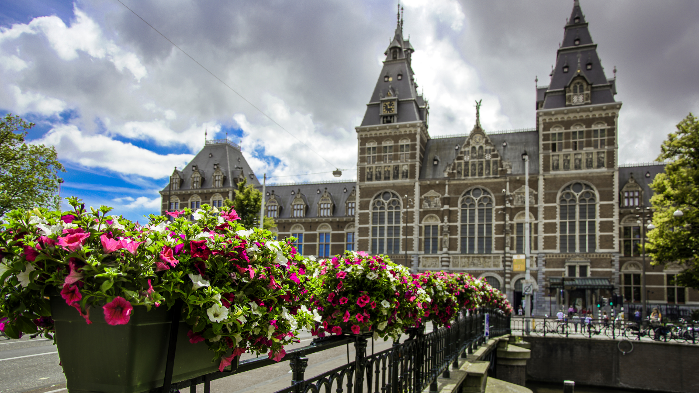
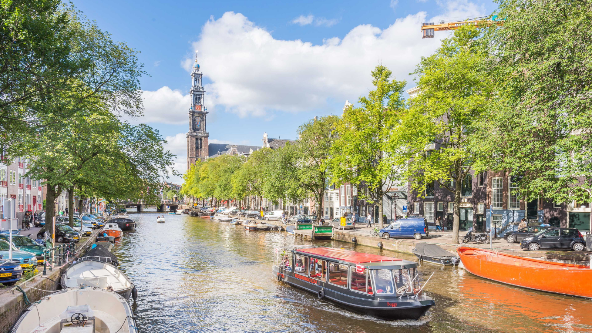
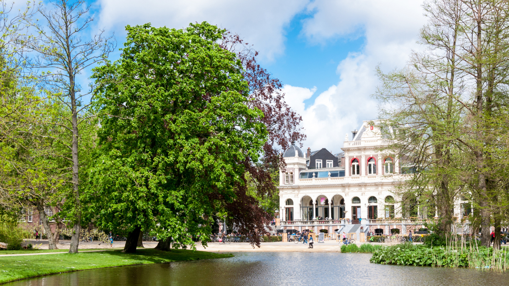

From it's storied history and museums to art/culture and a growing startup scene, Amsterdam makes for the perfect city to host QRL Hackathon 2022.

Whether you're travelling internationally or from within the EU, there's plenty of activities for you to enjoy during your stay in Amsterdam.

The multiday Hackathon is reason enough to travel...but why not enjoy the city's beauty as well while you're here.

Everyones tastes and preferences vary, therefore, we'll provide you with several short lists below to pique your interest for potential activities during your Hackathon stay...

* Museums
* Tours
* Parks
* Spontaneous

### Museums

Van Gogh Museum\
https://www.vangoghmuseum.nl/

Rijksmuseum\
https://www.rijksmuseum.nl/

Rembrandt House Museum\
https://www.rembrandthuis.nl/

NEMO Science Museum\
https://www.nemosciencemuseum.nl/

### Tours

Canal Tours\
https://www.iamsterdam.com/en/see-and-do/things-to-do/canal-cruising

Bike Tours\
https://www.iamsterdam.com/en/see-and-do/things-to-do/activities-and-excursions/cycling

Anne Frank House\
https://www.annefrank.org/en/

### Parks

Vondelpark\
https://www.hetvondelpark.net/

Beatrixpark\
https://www.amsterdam.nl/toerisme-vrije-tijd/parken/beatrixpark/

Oosterpark\
https://www.amsterdam.nl/toerisme-vrije-tijd/parken/oosterpark/

### Spontaneous:

AlbertCuyp Market\
https://albertcuyp-markt.amsterdam/?lang=en

Electric Ladyland - Museum of Fluorescent Art\
http://www.electric-lady-land.com/

Waterlooplein Flea Market\
https://waterlooplein.amsterdam/en/

Amsterdam library\
https://www.amsterdamlibrary.com/

Tulip Museum-https://amsterdamtulipmuseum.com/