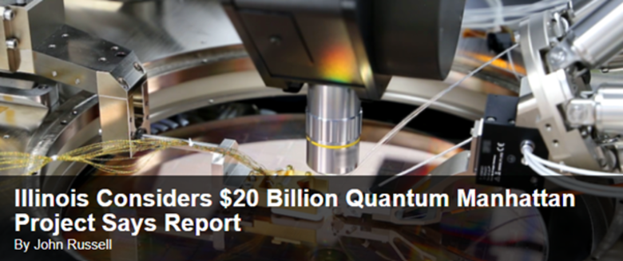
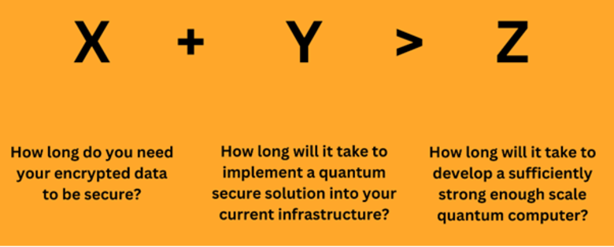

A Quantum Resistant Ledger (QRL) exists to provide a solid basis on which next generation blockchain ecosystems can be built. The founder and creator of QRL, Dr Peter Waterland, an accomplished cancer surgeon, identified as far back as 2016 that the growing blockchain world had a fundamental weakness: In the near future, Quantum Computers, due to their unique operating principles, will unravel the conventional cryptographic protocols which protect our digital world today.

This looming threat is a pressing concern to centralised entities, including corporations, banks and governments as well as an existential danger to blockchains. Without secure encryption, the very foundation of public blockchain disintegrates, unravelling the integrity and security of all who are not made ready for it.

Despite being regarded as science fiction in the 1990s, Quantum Computing (QC) soon became science fact. D-Wave Systems, _\-_ a pioneer in the field, _\-_ was founded in 1999 and advancements only accelerated during the 2010s. Roll forward to the 2020s and not a week passes without some development being announced in the QC field.

For example, Microsoft and Quantinuum’s recent [**breakthrough**](https://www.reuters.com/technology/microsoft-quantinuum-claim-breakthrough-quantum-computing-2024-04-03/) in the fidelity of their systems. So what exactly is the threat, what forms it and how and why is QRL different? This piece does not go into the basic concepts of blockchain – if that is required then [**here**](https://www.ibm.com/topics/blockchain) is a good place to start.

## Quantum Computers – The Good

Quantum computers are fundamentally different from the computers on which you are likely to be reading this (phone, tablet, or PC), as well as the supercomputers housed in large data centres. These machines, now termed classical computers, are built up of millions or billions of “bits” and operate on a binary system – they produce 1s or 0s, as the basis upon which all programming is carried out_._ Bits are relatively easy to understand – to build a more powerful computer you just need more of them. Since modern computing’s inception, arguably in the 1940s, significant architectural accomplishment by generations of engineers and scientists has enabled more and more bits to be squeezed into ever-smaller spaces. This is how the phone in your pocket today has more processing power than entire mainframes from the 1980s.

The basic building blocks of quantum computers are called ‘**qubits**’– they do not produce 1s or 0s in the way bits do, but have a number of other attributes that together give quantum computers their unique capabilities.

As well as 1 or 0, they can also behave as if they are in _both states simultaneously,_ by taking on a continuum of values made up of two complex numbers (numbers based on the square root of -1). This state is termed **superposition** and means the outcome of a qubit process is inherently probabilistic rather than deterministic.

Another feature of qubits is that of **entanglement**. This is a feature where two qubits become interdependent i.e. the state of one is dependent on the state of another. This means the state of one can be deduced from the state of the other.

Importantly, this entanglement exists regardless of the distance between the two qubits, an attribute crucial to many quantum computing processes. Finally, quantum computing depends on another property, that of **operational reversibility**, which allows algorithms to be run both forwards and backwards. If a qubit has a quantum operation performed on it, its state will change. However, another operation can be performed on it to return it to its original state; this enables the preservation of information. Incorporating this property into quantum circuits is essential for error minimisation (see below).

The properties of qubits—superposition, entanglement and operation reversibility—grant quantum computers computational capacities that, when properly harnessed, can outpace classical computing by orders of magnitude. This potential advantage is often referred to as ‘quantum supremacy. Superposition allows qubits to represent and process a continuum of values simultaneously. Entanglement creates interdependencies between qubits, enabling instantaneous state determination across distances.

Operation reversibility ensures quantum computations preserve information, enhancing efficiency and power. Collectively, these properties enable quantum computers to solve certain complex problems much faster than classical computers.

## Quantum Computers – The Bad

Unfortunately, working with qubits is rather complicated. As we have discussed, they do not provide a binary 1/0 outcome, but rather a probability-based outcome. In addition to this, they cannot be ‘read’ as you would read a bit. The act of measuring a qubit causes it to ‘**collapse**’- eliminating the probabilistic value and returning either a 1 or 0, an irreversible event.

Neither can a qubit be replicated due to the [**no-cloning theorem;**](https://en.wikipedia.org/wiki/No-cloning_theorem) it is fundamentally impossible to recreate any qubit in superposition. This particular attribute means that a key method of classical error-correction (that of reproducing calculations) cannot be employed.

## Quantum Computers – The Ugly

This combination of probabilities, the destructive nature of reading the qubit, difficulties in checking answers and easy interference from environmental factors (radio waves, heat, magnetic fields or even neighbouring qubits), compounds the uncertainty of outcome of any QC calculation or algorithm. This uncertainty is referred to as **noise.**

This qubit-qubit interaction is particularly challenging for engineers – as the number of physical qubits grows, the amount of interaction increases, greatly amplifying noise. It has been compared to balancing ping-pong balls on top of each other – balancing two is hard enough, but three, four, and five gets inordinately more challenging and the noisier the QC becomes.

The _noisier_ a system is, the more prone to error it is, or the more uncertain you can be that the result is a _true_ result.

The good news is this uncertainty can be mitigated through architectural choices, such as qubit type and topology, design redundancy, careful engineering and software compensation for noise. This is accounted for in the terminology used. The physical building blocks which are used are referred to as **physical qubits** and, the ‘power’ of the computer, after the **error-correction** (mediated by both hardware and software compensation), is measured in **logical qubits.**

## Quantum Computers – The leaps ahead

One exciting aspect of this field is the sheer number of different approaches teams are taking to developing quantum computing power: **neutral atoms, spin, photonic, superconducting, ion-trap** and **topological qubits** are all completely different from each other, each with its own challenges and advantages.

Billions of dollars are being spent by some of the biggest corporations and governments around the world on these diverse approaches, demonstrating the breadth of innovation driving advancement of quantum computing technology. Hardware improvements are being coupled with enhanced error-correction techniques and hybrid platforms integrating both classical and quantum processes are being explored.

The syzygy of machine learning advances, quantum computing and rapid progression in materials science is likely to give rise to a period of unfathomable technological developments which will reach into every aspect of our lives.

## Classical Encryption in Blockchain

Currently, nearly all blockchains (QRL is the only open-source MIT-licensed exception to this) are built on the back of something called **Elliptic Curve Cryptography** (ECC)- also known as **Elliptic Curve Digital Signature Algorithm** (ECDSA).

The basis of this encryption is that it is incredibly easy for classical computers to multiply very large prime numbers together, but unfeasibly difficult to factor (divide) them. And large really does mean large, the numbers involved are more than 77 digits long. For comparison, the number of atoms _in the_ _known universe_ is about 7 followed by 17 zeros – a mere 18 digits.

When you create a wallet address for your blockchain/cryptocurrency, it generates a **private key** for you – this is the one that gives you full access to the wallet; your crypto is sent using this.

The private key makes you the absolute ruler of that wallet, and it must be kept _completely secret_ to remain secure. This wallet is useless though if you cannot have funds sent to it, which means it needs an identifier that can be shared with other people - basically an address. This is termed the wallet’s **public key** and is calculated by _multiplying_ your private key by a function of an elliptic curve (there are many different curves out there - for example Bitcoin uses one called Secp256k1). With that, you can now safely publicise your public key and be confident someone cannot derive your private key from it.

It is the sheer size of the numbers involved that give ECC its security. To ‘brute force’ (trial and error of every permutation) ECC in use today would take longer than the age of the universe. It simply is not happening. At least, not until QC comes along – i.e, a large enough and error-corrected enough QC.

## The QC/Blockchain Intersection

While ECC is ‘unbreakable’ for classical computers, the same cannot be said for QC whose singular capabilities can be leveraged using a quantum function called **Shor’s Algorithm** to undo this form of cryptography.

In 1994, Peter Shor established a series of equations which would allow a quantum computer to factor these incomprehensibly large numbers in real time. Rather than taking longer than the age of the universe, this can be done in minutes, hours or days.

This is referred to as a _polynomial speed-up_, and it means the once impregnable security of blockchain wallets will no longer be guaranteed. Anyone with a sufficiently powerful QC will be able to work out the ‘combination to the safe’. They will become the ruler of the wallet and can transfer or spend the coins it holds as they choose.

It should be noted Shor’s Algorithm is actually quite a ‘deep’ process that requires many operations to be performed in succession. This means quantum information needs to be kept live for a long time and is why the number of qubits required to decrypt ECC using this algorithm, is larger than some other quantum computing applications.

There are other ways that QC will interact with blockchain - [Grover’s Algorithm](https://dl.acm.org/doi/10.1145/237814.237866) will enable a quadratic speed-up of brute force attacks of some encryption, which is likely to have an interplay with blockchain. That said, it is a harder algorithm, with many more implementational challenges, so it is Shor’s which represents the more immediate threat to ECC.

Another aspect of the development of QC is the fact that further technical advancements are likely to come thick and fast. There will truly be a quantum revolution as entirely new _fields_ are opened as a result of this new way of manipulating data.

Cryptography is likely to be one of the fields more directly affected - it is probable there will be a rapidly moving ‘arms race’ between novel encryption methods and their hasty counter with new decryption methods. Because of this, a fundamental requirement of blockchains in the future will not be simply using quantum-secure technology, but also being able to utilise new cryptographic tools as they become available. This nimbleness is termed **‘cryptoagility’.**

## The Blockchain Counter

Of course, quantum computers are not just coming for blockchain, but will pose threats (as well as abundant opportunities) across many fields. The good news is that there are plenty of currently\* quantum-secure encryption methods out there and so things can remain secure (\*nothing can guarantee security long term and this is exactly why cryptoagility is essential).

Centralised organisations (governments, corporations, messenger services, banks, ISPs), have the relative luxury of direct control over their encryption. Security officers can devise ways to incorporate post-quantum code into the provided services and render their contents safe once again.

In fact, many organisations have already done this - Apple has [**secured**](https://security.apple.com/blog/imessage-pq3/) iMessage; Cloudflare is [**securing**](https://blog.cloudflare.com/post-quantum-to-origins) https; the US Federal Government has [**mandated**](https://www.csoonline.com/article/2119505/us-government-could-mandate-quantum-resistant-encryption-from-july.html) all departments and contractors migrate to QS encryption. A global effort to pre-empt the quantum threat is already underway. The challenge for Chief Information Security Officers and the engineers who work for them will be building cryptoagility into their systems from now on.

Encryption that is secure today _will_ be broken at some point in the future. This brings us to another eponymous piece of work, that of [Mosca’s Theorem](https://www.theqrl.org/blog/grasping-the-quantum-threat-with-moscas-theorem/). Mosca’s Theorem was initially conceived as a warning for ‘hack now, decrypt later’ attacks, a similar issue faces public blockchains. Put simply, decision-making and adoption take time, if that time is longer than it takes to build a sufficiently powerful QC, you have a problem. For many organisations it will be sensitive information at stake, for blockchains it is faith in the entire technology.

It is relatively easy to organise these things when you know the deadline and are in a position to influence development timelines. Take away the certainty of a known deadline, remove autocratic powers and suddenly response timelines can stretch far into the future. There are significant technical challenges that blockchains will face as well- lots of them will be to the detriment of the chain (e.g., post-quantum signatures resulting in the chain becoming slower and more expensive) and will likely further prolong the process of gaining consensus for whatever solution or mitigation is sought.

The first thing which needs to happen for legacy blockchains to counter the development of QC, is for the threat to be acknowledged. While centralised entities have already begun to acknowledge the threat and develop plans to mitigate the risk with relative rapidity, blockchain and cryptocurrencies have been notably nonchalant in their response to this burgeoning threat. The debate is beginning to grow now around the hazards which will confront blockchains and thankfully it is not being dismissed out of hand.

Chief among these options is to adopt new signature schemes and then effectively start a new chain. A hard or soft fork will not suffice on its own. As it is the wallets themselves which are vulnerable to Shor’s Algorithm, it is they that will need to be modified to include a Post Quantum (PQ) secure signature. While this can be largely automated, there are a [**number of obstacles**](https://faqq.info/wiki/Main_Page) to it and it is likely to require some sort of user input.

Initially, suitable PQ signatures need to be devised and agreed on. PQ signatures can be large and heavy - they are slow and expensive to deal with. Optimising this will take considerable effort and selecting the ideal signatures to standardise is already the source of considerable debate. It is likely that by many measures, the chain will function _worse_ after the upgrade. Significant compromises and trade-offs will have to be made.

As a side note, it should also be noted there is no verifiably-PQ secure signature aggregation mechanism at present – the absence of such technology will hugely increase expense and possibly compromise the ability of the chain to function as it does today. Hopefully, investigation of this will come soon and a peer-reviewed PQ aggregator will be developed.

Assuming that satisfactory PQ wallets have been devised and agreed upon, the next obstacle is one of the migration itself. In the event the migration cannot be executed on a systems level, it will require individual coin holders to perform some action which will migrate the tokens/coins from the legacy wallet to the new one.

But what of the lost wallets, or people who are simply not paying attention? A decision will have to be made about how long this window of opportunity lasts. Otherwise, a QC could raid old wallets creating a rush of new holders to migrate to a new PQ wallet. It is a big decision to consign millions of dollars of cryptocurrency to the dustbin, but that is what will need to happen.

Timing is also the root of the next issue: when to perform the migration? This could range from the immediate – before QCs are near the size necessary to threaten ECC, to the retrospective – when thefts are already occurring.

Unfortunately, it appears that present plans for Ethereum consist of this [**rearguard approach**](https://ethresear.ch/t/how-to-hard-fork-to-save-most-users-funds-in-a-quantum-emergency/18901): wait until it is obvious a QC is already stealing funds and then roll back the chain; migrate to the new crypto and then restart the chain...! This approach flies in the face of the immutability of blockchain. It also leaves serious questions about the billions of dollars’ worth (not to mention legal liabilities) of transactions taking place via L2 tokens during this rollback period, when transactions become nullified – literally expunged from the record.

It also seems to accept some theft as inevitable. How much ‘sub-threshold’ theft will occur? What will happen to confidence in the chain as ‘Q-Day’ approaches and transactions and the currency itself are increasingly at risk?

As they say, “the best time to plant a tree was 20 years ago, the next best time is now.” The best thing which can happen is a pre-emptive move is made, but that does not solve the thorny issue of degradation of the capabilities of the chain.

An interesting note, this time about Bitcoin, is the Taproot ‘upgrade’ [**significantly weakened**](https://cointelegraph.com/learn/a-beginners-guide-to-the-bitcoin-taproot-upgrade) its PQ security by broadcasting the public key of every new wallet onto the chain. Prior to this, the public key was only made visible at the time of a transaction.

It is also notable that in the early days of Bitcoin, all wallets had their public keys visible. The so-called ‘Satoshi’s Millions’ are there for the taking for the first dishonest person who builds a powerful enough QC.

Another question Bitcoin will have to answer come the day of PQ adoption is ‘how to migrate?’ Bitcoin currently manages seven transactions per second. At this rate it will take the network more than 80 days to chew its way through the 50 million wallets which have a non-zero balance. Three months with no other transactions on it other than a PQ migration scheme? It simply does not seem feasible. Hopefully, far more pragmatic solutions will become available_._

The increase in discussion around the PQ threat is to be welcomed and encouraged. As with so many things in life though, the devil is well and truly in the detail. With unknown timelines, it is far better to accelerate the discussion so basic principles can be established, and effort can be redirected to working out the logistics of the evolution from legacy chains to PQ chains. It is not trivial.

The Quantum Resistant Ledger

The [**Quantum Resistant Ledger**](https://www.theqrl.org/) is more than simply a quantum-computing resistant ledger, it possesses unique characteristics that make it extraordinarily well-placed to not just survive in a quantum era, but thrive.

As it stands, QRL:

- Has been running a **Proof-of-Work** mainnet since June, 2018
- Uses verifiably quantum-secure and [**recommended**](https://nvlpubs.nist.gov/nistpubs/SpecialPublications/NIST.SP.800-208.pdf) **eXtended Merkel-tree Signature Scheme (XMSS)**
- Is **Open-Source**
- [MIT Licensed](https://github.com/theQRL/QRL/blob/master/LICENSE)
- Inherent cryptoagility makes it future-proof

But there are more developments on the horizon. QRL is moving to a Proof-of-Stake (POS) network currently under development, scheduled to be released in Q1 2025. Not only will this ensure a more energy-efficient, eco-friendly network, but it means the so-called 51% attack (more commonly a threat in Proof-of-Work blockchains) becomes even more unfeasible.

With this new PoS network comes a profound upgrade – the network will be compatible with the **Ethereum Virtual Machine (EVM).** This means any tokens currently existing on the currently quantum-vulnerable Ethereum chain (usually as an **ERC20** token) can be replicated on the QRL chain. In a stroke, the inevitable threat that quantum computing poses can be nullified.

Further research and technical developments will continue to be funded by the [**QRL Foundation**](https://qrl.foundation/), as the challenges of maintaining a cryptoagile ecosystem will continue. One of the more significant challenges will be the creation of PQ signature aggregation schemes, which meet the same high standards of peer-review and accreditation which typify the quality of work which is the backbone of QRL.

Whatever the future holds, QRL will continue to grow and evolve to meet challenges. Natural selection is everywhere - the adage of ‘only the fittest survive’ holds true even at the cutting edge of high-end tech.

Only the fittest survive, but only those with foresight and vision truly thrive.