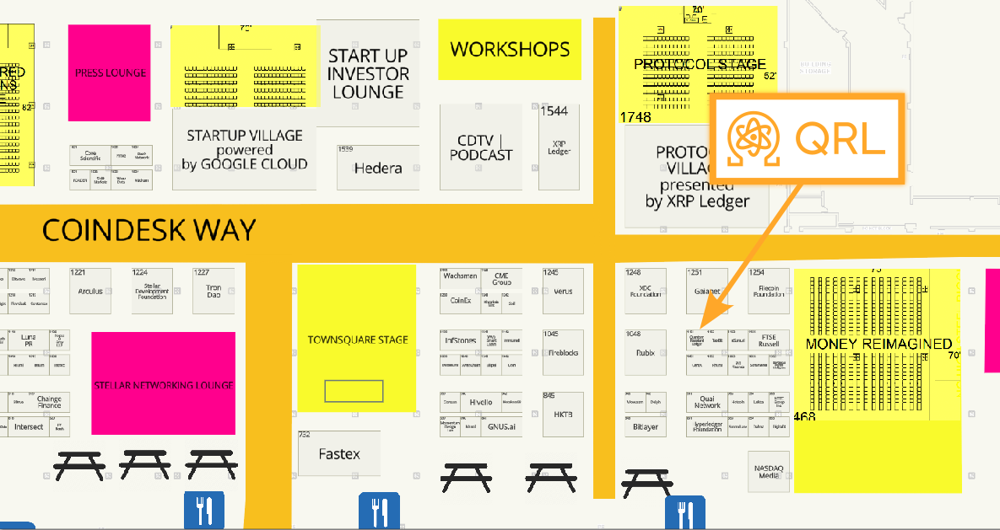


<blockquote id="information">
Confused about getting started? Come check out our booth for more information on the NFC tag hunt.
</blockquote>



## Step 1: Get the QRL wallet

Download the QRL wallet developed by Volt Development on the Google Play or Apple Store.

- [Volt Development Google Play store](market://details?id=com.volt.qrlmobile)
- [Volt Development Apple Store](itms-apps://itunes.apple.com/app/id6448219494)

## Step 2: Get QRL

Go to the QRL Booth for some initial QRL to start your journey

## Step 3: Look out for QRL NFC stickers

Enjoy the conference, any time you find a sticker create a message transaction with the code provided on this page (see the next step). 

Stickers will look like this:

## Step 4: Create a message transaction

1. Open the QRL Wallet
2. Go to Tools
3. Click on "Send Message"
4. Copy the code into the message area

## Step 5: Win the grand prize

All 34 stickers is enough to create a mnemonic, so write them down! This opens a wallet. 

From that wallet create a message transaction with your address in it and come to a team member to show us. 



