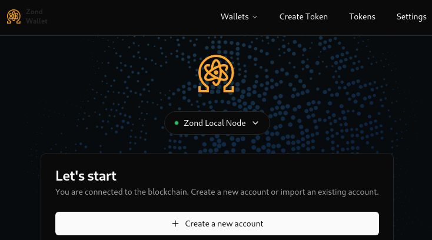
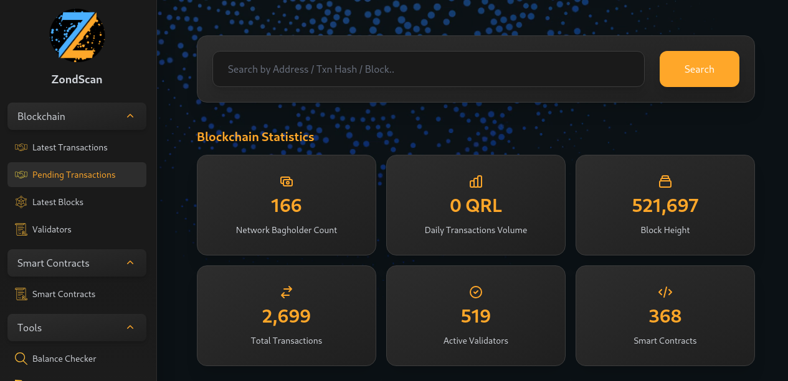

> This page is live so be sure to bookmark it and check back for any updates
>
> Last Updated: Monday, February 24, 2025

## Table of Contents



## Overview

At ETHDenver 2025 we’re thrilled to announce the Project Zond BUIDL Testnet Preview, our latest advancement in quantum-secure blockchain technology. Project Zond delivers exceptional improvements across multiple dimensions, enabling two major breakthroughs.

- **Post-Quantum Security:** Project Zond effectively protects your blockchain applications from the imminent threat of quantum attacks. This addresses a critical challenge in ensuring the long-term security of decentralized systems.
- **Ethereum Integration:** Leveraging the Zond Virtual Machine (ZVM), Project Zond is fully compatible with the Ethereum Virtual Machine (EVM). This compatibility allows developers to continue using their favorite tools while enhancing their smart contracts with quantum-resistant security.

## Come find us

Join the Quantum Resistant Ledger (QRL) core team in the Privacyville (next to the Coffee Lounge!) to explore Project Zond — a groundbreaking leap in quantum-resistant blockchain technology.

## Quick Resource Links

### Bounty / Development Related

- Our Devfolio Bounty Link: https://ethdenver2025.devfolio.co/prizes?partner=The+Quantum+Resistant+Ledger
- Documentation: https://test-zond.theqrl.org/testnet
- GitHub: https://www.github.com/theQRL/
- GitHub Discussions: https://github.com/orgs/theQRL/discussions

### Community / Social

- Discord: https://www.theqrl.org/discord
- Telegram: https://www.theqrl.org/telegram
- Reddit: https://www.theqrl.org/qrl

### Updates

- X/Twitter: https://www.x.com/QRLedger
- Our blog: https://www.theqrl.org/blog
- Discord: https://www.theqrl.org/discord
- Telegram: https://www.theqrl.org/telegram
- Project Zond Roadmap: https://www.theqrl.org/roadmap/#project-zond

## Active decentralized development

> **Important:** These projects are running on the Zond BUIDL Preview and Zond Best-Testnet, and are under active development. Expect potential instability and bugs. Use at your own risk. Remember, executing code from unfamiliar sources carries inherent risks.

### QRL Zond Website Token Generator

Secure your assets against future threats with quantum-resistant blockchain technology and create Your Own Tokens on the Quantum Resistant Ledger Zond Testnet in a nice web interface.

From Volt Development.



### Zond Web Wallet

Send and receive assets on Zond as well as create, view and transfer tokens in you wallet in a nice web interface.

From Moscow Chill (Discord Member)



### Zond Testnet #BUIDL Preview Setup Script

Scripts for the Zond Testnet #BUIDL Preview. The script automatically detects your operating system and installs all necessary prerequisites for running a local Zond testnet.

From Moscow Chill (Discord Member)



### Zond Scan

Explore Zond network activity with Zond Scan. Track daily transactions, block height, total transactions, and active validators. Analyze smart contracts, view the latest blocks and transactions, and utilize tools like the balance checker and unit converter.

From Moscow Chill (Discord Member)



### Showcase your project here!

We'll try to add projects as we see them but there's going to be a delay as we're at EthDenver as well. The projects above aren't necessarily those submitted to ETHDenver 2025. 

Have a Project Zond community project you want to showcase? Just let us know in our [Discord](/discord) or [Telegram](/telegram).
