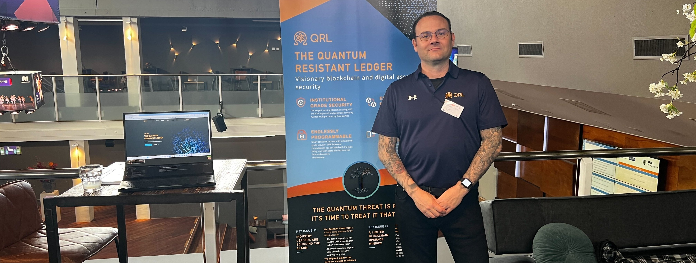

## Weekly Development Snapshot

- Recomputed the time to process the batch of blocks and adjusted the p2p timeouts to fix the syncing issue
- Early testing: 20x increase in syncing speed
- Unit Tests for the beacon client is in progress
- Refactoring and bug fixes for both beacon & consensus engine
- Re-released new testnet with the latest changes along with the fix with syncing issue
- Evaluating the number of sync committee required to securely support the light client 

<!--more-->

### PKIC Post-Quantum Cryptography's (PQC) Conference

[The QRL Foundation](https://qrl.foundation/) is happy to be a [member of the PKI Consortium](https://pkic.org/members/the-qrl-foundation/) as well as sponsor of PKI Consortium's second hybrid [Post-Quantum Cryptography's (PQC) Conference](https://pkic.org/events/2023/pqc-conference-amsterdam-nl/) in **Amsterdam, the Netherlands** on **November 7 and 8** (now as of this newsletter)

Michael Strike, our Director of Outreach, will be there and will remain until the afternoon of November 10th. Are you in Amsterdam and would want to get together with Michael Strike? Contact him by email at [m.strike@theqrl.org](mailto:m.strike@theqrl.org) or Discord ([.strikeattack](https://discord.com/users/447363112715157514)).

Be sure to peruse the [Post-Quantum Cryptography Conference](https://pkic.org/events/2023/pqc-conference-amsterdam-nl/) page to learn more. If you're keen on attending, the registration instructions can be found there as well.

## QRL Monthly: feat QRL Zond private beta-testnet - October 2023

QRL Zond moves to a private beta-testnet with quantum resistance and EVM-compliant smart contracts with a public beta-testnet on the horizon. Community project, Q-day.org investigates the fascinating intersection of quantum computing and cryptocurrency.

Read more in our [QRL Monthly blog](/blog/qrl-monthly-feat-qrl-zond-private-betatestnet-october-2023/)

## Quantum News

{}
