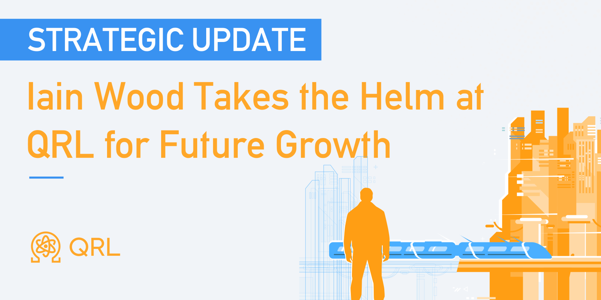

## Weekly Development Snapshot

- Released private testnet with reduced sync committee size 16.
- Parameter changes such as minimum staking reward, epoch size, block reward, decimals etc. are in progress.
- Necessary code changes to support the new parameters are in progress.
- Unit tests for beacon client are in progress.

## New Blog - QRL: The Next Chapter

The QRL project has appointed Iain Wood as its new operational manager, entrusting him with strategic goals such as community growth and finalizing the project’s roadmap. The original creator reflects on the journey, expressing excitement for QRL’s future while transitioning to an administrative role. [Learn more about these developments in our blog post.](/blog/qrl-the-next-chapter/)

<!--more-->

## The QRL Show -  Understanding Quantum Technology with Anastasia Marchenkova 



If you haven't already, join us for a special episode of the QRL Show, featuring Anastasia, a quantum computing expert, and Michael Strike, from Quantum Resistant Ledger (QRL). They'll discuss the urgency of post-quantum cryptography, common patterns in quantum threat conversations, and the anticipated developments in quantum tech over the next 2-5 years. Explore innovation in quantum computing, the current state of the field, major players like IBM and Qiskit, and instances of misinformation.

## Bittrex Global Status Update

Bittrex Global has informed the QRL Team that the process of bringing the QRL Wallet online has commenced.

## Quantum News

{}
