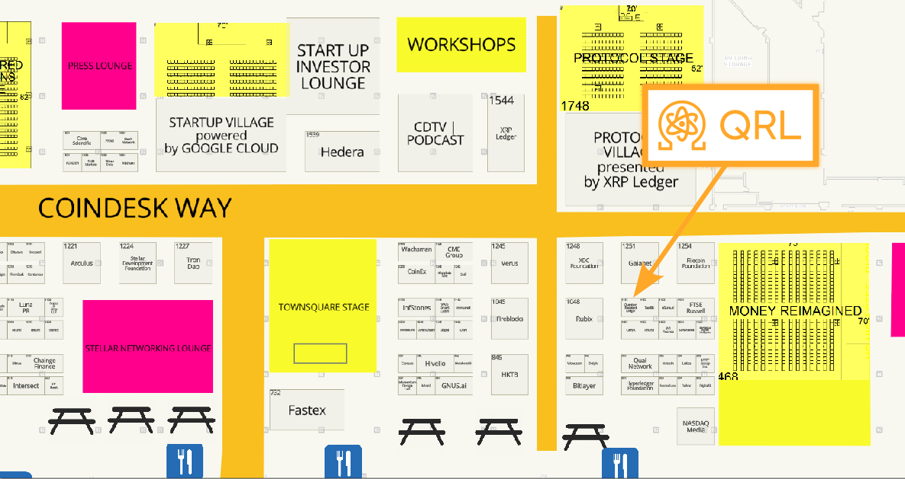

## Weekly Development Snapshot

- Javascript implementation of XMSS sign and verification function is in progress.
- Reviewed code for withdrawal processing & attestor slashing
- Code review in progress for attestor verification & processing, State, Initial Sync, epoch transition, validator's reward, penalty logic & validator shuffling
- TrueBlocks fork indexing complete, working through validation and testing of readiness for explorer integration
- Maintenance patches to zond-explorer and zond-wallet alpha releases
- zond-wallet PWA build in progress
- dilithium5 cli tool experimental work

## See us at Consensus 2024 in Austin, TX

We are excited to announce that QRL will be participating in Consensus 2024, hosted by Coindesk in Austin, TX. Our team members Craig Clement, Iain Wood, Jack Matier, James Gordon, Michael Strike, and Ryan Malinowski will be there to represent QRL and educate on the quantum future! 

If you're at consensus, we're at booth 1151. If not, but are still in Austin, TX, we have a half hour [QRL Post-quantum run at 7am local](https://docs.google.com/forms/d/e/1FAIpQLSdUAIzCrLH4ScUHc3QP0pUy0wZwynkL551hpfxzlLf7CTtjoA/viewform) that you're welcome to attend. Otherwise, just message one of the team members and we'll work something out!

<!--more-->

## Quantum News

{}
