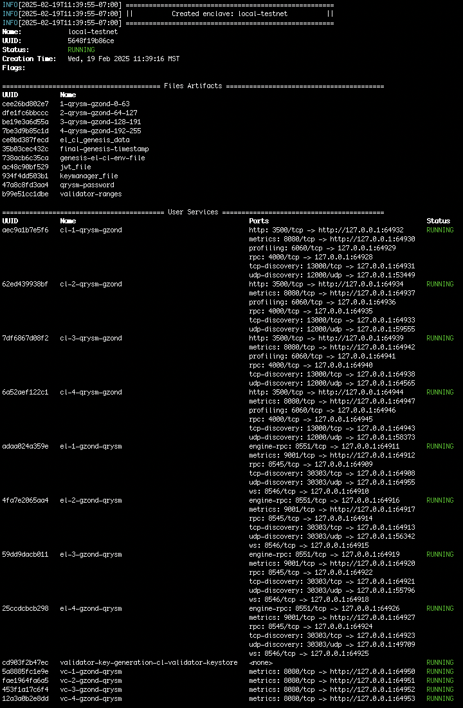

## Weekly Development Snapshot

- Released **Zond Private Testnet V1 Preview (internal)** to the team for extended testing and documentation.
- Full network (gzond & qrysm) running in a Docker network using the **Zond Package** (a [Kurtosis](https://github.com/kurtosis-tech/kurtosis) fork) that automatically establishes state on boot, providing access to prefunded wallets and a Web3 endpoint for application development.
- [Zond Roadmap progression update](https://www.theqrl.org/roadmap/#project-zond)

Those paying close attention might have noticed a bunch of new updates and repositories in our [GitHub](https://www.github.com/theQRL/):

- [New Repository] **gozvmlab**: Modified for ZVM; features a minimal "compiler," tooling for trace visualization in the UI, and the ability to execute scripts against ZVMs (gzond).
- [New Repository] **FuzzyVM**: A framework for fuzz testing Zond Virtual Machine implementations.
- [New Repository] **tx-fuzz**: Provides helpful functions to create random transactions, enabling easy access to fuzzed transactions from within other programs.
- [Update] **go-zond**: Introduced a new address format, removed obsolete byte codes, implemented bug fixes, and increased `maxRequestContentLength` to 10 MB to accommodate transaction-heavy blocks. Updated Go version and resource_class for macOS. Also includes Clef and CircleCI updates.
- [Update] **qrysm**: Updated tests, fixed bugs, added support for the new address format, and more. Enabled `testTxGeneration` for 1000 transactions, updated Docker build parameters, added `publish-docker-images` in CircleCI, and provided Clef example configuration pointing to the Zond package's main branch.
- [Update] **web3.js**: Updated with a new address format, improved tests, and additional enhancements.

<!--more-->

